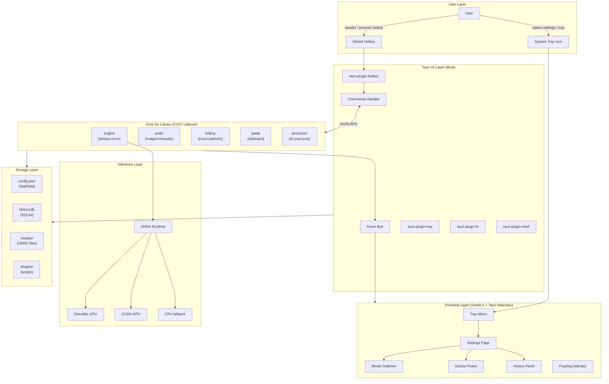
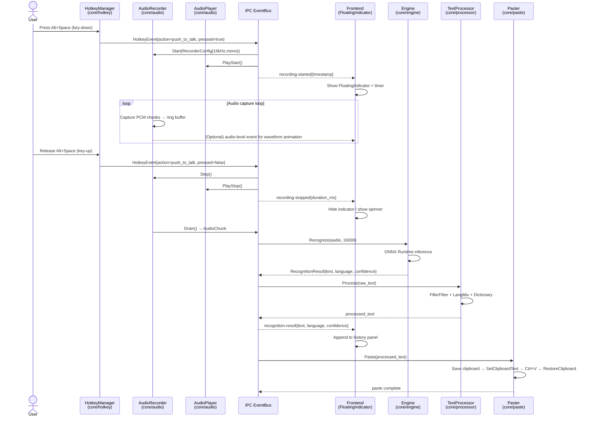
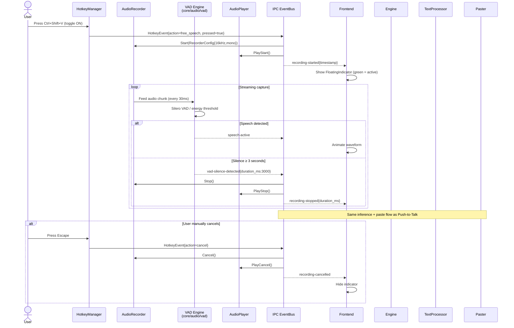
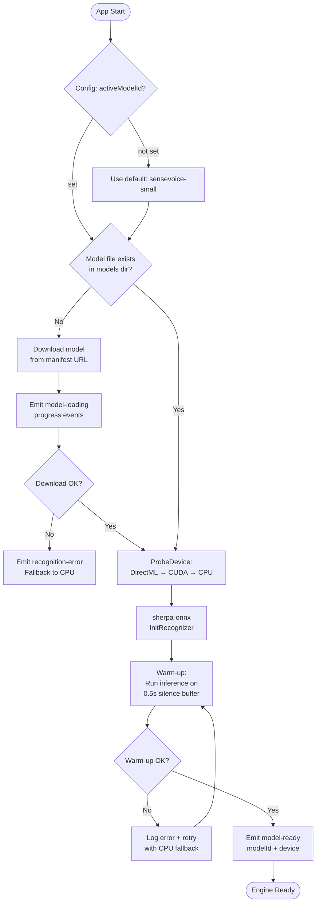

# Voice-typeless (VTL) — Architecture Document

> **版本**：v1.0-draft  
> **作者**：Architect Agent  
> **最後更新**：2026-04-21  
> **狀態**：APPROVED — Core Agent / Frontend Agent 可據此實作

---

## Table of Contents

1. [System Overview](#1-system-overview)
2. [Project Structure Explanation](#2-project-structure-explanation)
3. [Core Go Library API Design](#3-core-go-library-api-design)
4. [IPC Protocol (Go Core ↔ Tauri ↔ Frontend)](#4-ipc-protocol)
5. [Data Flow Diagrams](#5-data-flow-diagrams)
6. [Configuration Schema](#6-configuration-schema)
7. [Audio Pipeline](#7-audio-pipeline)
8. [Model Architecture](#8-model-architecture)
9. [Clipboard Protection Design](#9-clipboard-protection-design)
10. [Plugin System Architecture](#10-plugin-system-architecture)
11. [Windows 7 Compatibility Layer](#11-windows-7-compatibility-layer)
12. [Technology Decision Log](#12-technology-decision-log)
13. [Dependency Graph](#13-dependency-graph)

---

## 1. System Overview

### 1.1 High-Level Architecture



### 1.2 Component Responsibilities

| Component | Layer | Responsibility | Boundary |
|-----------|-------|---------------|----------|
| **Svelte 5 Frontend** | Frontend | All user-visible UI: settings, tray menu, floating indicator, history panel | Pure UI, no business logic |
| **Tauri v2 Runtime** | Bridge | WebView host, native window management, IPC routing, OS integration | Thin bridge only; no recognition logic |
| **Tauri Plugins** | Bridge | Global hotkey capture, system tray, file system access, shell commands | Platform-specific OS calls |
| **core/audio** | Core | Microphone enumeration, PCM capture at 16 kHz mono, ring buffer, VAD | Only audio I/O — no inference |
| **core/engine** | Core | sherpa-onnx lifecycle, model loading, GPU/CPU dispatch, streaming inference | Only speech recognition — no UI |
| **core/hotkey** | Core | Cross-platform hotkey registration fallback (used when Tauri plugin unavailable) | Platform abstraction |
| **core/paste** | Core | Clipboard save/restore, simulated keyboard paste, per-platform API | Only clipboard & paste |
| **core/processor** | Core | Filler-word filter, punctuation restoration, language mixing normalization, custom dictionary | Only text post-processing |
| **models/** | Storage | ONNX model files, metadata JSON, download manager | Passive file store |
| **plugins/** | Extension | User scripts loaded at runtime; transform recognition results | Sandboxed; no system access |

### 1.3 Why Tauri v2 over Wails v3

| Criterion | Tauri v2 | Wails v3 | Decision |
|-----------|----------|----------|----------|
| **WebView footprint** | Uses OS WebView (< 1 MB added) | Bundles Chromium or OS WebView | Tauri ✅ |
| **Security model** | Rust core + explicit capability permissions per command | Go runtime, weaker sandbox | Tauri ✅ |
| **Plugin ecosystem** | Official plugin registry (hotkey, tray, fs, updater, etc.) | Manual integration required | Tauri ✅ |
| **Go integration** | Go as CGO lib or sidecar process | Go is the host runtime | Wails easier, but acceptable |
| **Cross-platform** | Windows / macOS / Linux tier-1 | Same | Tie |
| **Auto-updater** | `tauri-plugin-updater` built-in | Third-party | Tauri ✅ |
| **Bundle size** | ~3–8 MB installer | ~5–15 MB | Tauri ✅ |

**Decision**: Tauri v2. Go Core runs as a **sidecar process** (spawned by Tauri) communicating over a local Unix socket / named pipe. This cleanly separates Rust security from Go business logic and avoids CGO complexity on Windows.

---

## 2. Project Structure Explanation

```
Voice-typeless/
├── core/                        # Independent Go library (go module: github.com/vtl/core)
│   ├── engine/                  # Speech engine abstraction — sherpa-onnx wrapper
│   │   ├── engine.go            # Engine interface + factory
│   │   ├── sensevoice.go        # SenseVoice model implementation
│   │   ├── whisper.go           # Whisper-tiny model implementation
│   │   ├── custom_onnx.go       # Generic ONNX model loader
│   │   ├── device.go            # GPU/CPU device selection algorithm
│   │   └── warmup.go            # Model warm-up strategy
│   ├── audio/                   # Recording + sound effects (malgo)
│   │   ├── recorder.go          # AudioRecorder implementation
│   │   ├── player.go            # AudioPlayer (marimba sounds)
│   │   ├── devices.go           # DeviceEnumerator
│   │   ├── ringbuf.go           # Lock-free ring buffer
│   │   ├── vad.go               # Voice Activity Detection
│   │   └── sounds/              # Embedded sound files (.ogg)
│   ├── hotkey/                  # Cross-platform hotkey manager
│   │   ├── hotkey.go            # HotkeyManager interface
│   │   ├── hotkey_windows.go    # Windows RegisterHotKey API
│   │   ├── hotkey_darwin.go     # macOS Carbon/Cocoa hotkey
│   │   └── combo.go             # Key combo parsing
│   ├── paste/                   # Paste + clipboard protection
│   │   ├── paster.go            # Paster interface
│   │   ├── paste_windows.go     # SendInput + OpenClipboard
│   │   ├── paste_darwin.go      # NSPasteboard + CGEvent
│   │   └── guard.go             # ClipboardGuard (save/restore)
│   ├── processor/               # AI post-processing + filler-word filter
│   │   ├── processor.go         # TextProcessor interface + pipeline
│   │   ├── filler.go            # FillerWordFilter (zh + en + ja + ko)
│   │   ├── punctuation.go       # Punctuation restoration
│   │   ├── language_mix.go      # Mixed-language space normalization
│   │   ├── dictionary.go        # Custom dictionary replacement
│   │   └── filler_words.go      # Embedded filler word lists
│   ├── config/                  # Config schema + file I/O
│   │   ├── config.go            # AppConfig struct + Load/Save
│   │   └── defaults.go          # Default values
│   ├── history/                 # SQLite history store
│   │   ├── history.go           # HistoryStore interface
│   │   └── sqlite.go            # SQLite implementation
│   ├── ipc/                     # Sidecar IPC server
│   │   ├── server.go            # JSON-RPC server (named pipe / Unix socket)
│   │   └── protocol.go          # Request / Response types
│   └── go.mod                   # Module: github.com/vtl/core
│
├── frontend/                    # Svelte 5 + Vite frontend
│   ├── src/
│   │   ├── routes/              # SvelteKit pages (if SvelteKit; else flat components)
│   │   ├── components/
│   │   │   ├── FloatingIndicator.svelte
│   │   │   ├── HistoryPanel.svelte
│   │   │   ├── SettingsPage.svelte
│   │   │   ├── ModelSwitcher.svelte
│   │   │   └── DevicePicker.svelte
│   │   ├── stores/              # Svelte 5 runes-based stores
│   │   ├── lib/
│   │   │   ├── tauri.ts         # Typed Tauri command wrappers
│   │   │   └── events.ts        # Typed event listeners
│   │   ├── styles/
│   │   │   └── globals.css      # TailwindCSS + VTL design tokens
│   │   └── app.ts               # Entry point
│   ├── package.json
│   ├── vite.config.ts
│   ├── tailwind.config.ts
│   └── tsconfig.json
│
├── src-tauri/                   # Tauri Rust bridge
│   ├── src/
│   │   ├── main.rs              # Tauri application bootstrap
│   │   ├── commands.rs          # #[tauri::command] handlers (proxy to sidecar)
│   │   ├── sidecar.rs           # Go sidecar process management
│   │   ├── tray.rs              # System tray setup
│   │   └── updater.rs           # Auto-update logic
│   ├── icons/                   # App icons (all resolutions)
│   ├── capabilities/            # Tauri v2 capability JSON files
│   └── tauri.conf.json          # Tauri configuration
│
├── plugins/                     # User plugin scripts
│   ├── README.md                # Plugin API documentation
│   └── examples/
│       ├── uppercase.js         # Example: transform to uppercase
│       └── code_format.lua      # Example: code mode formatting
│
├── models/                      # Speech model files
│   ├── manifest.json            # Available models metadata
│   ├── downloader/              # Go model download manager
│   │   └── downloader.go
│   └── sensevoice-small/        # Default bundled model
│       ├── model.onnx
│       └── meta.json
│
├── docs/                        # Documentation
│   ├── agents.md                # Multi-agent specification
│   ├── architecture.md          # This file
│   └── api.md                   # Public API reference
│
├── build/                       # Build scripts
│   ├── build_windows.ps1        # Full Windows (10/11) build
│   ├── build_win7.ps1           # Win7 slim build (CPU only)
│   ├── build_macos.sh           # macOS build + notarization
│   └── Makefile                 # Cross-platform make targets
│
├── scripts/                     # Dev helper scripts
│   ├── download_models.ps1      # Pre-download default models
│   ├── gen_icons.sh             # Generate icon variants
│   └── check_deps.ps1           # Verify dev environment
│
└── tests/                       # E2E tests
    ├── e2e/                     # Playwright-based E2E
    ├── integration/             # Go integration tests
    └── fixtures/                # Audio fixture files (.wav)
```

---

## 3. Core Go Library API Design

All packages live under `github.com/vtl/core`. Each package exports only stable public interfaces; implementation types are unexported.

### 3.1 core/engine

```go
// core/engine/engine.go

package engine

import (
    "io"
    "time"
)

// ModelType identifies the speech recognition model variant.
type ModelType string

const (
    ModelSenseVoice  ModelType = "sensevoice"
    ModelWhisperTiny ModelType = "whisper-tiny"
    ModelCustomONNX  ModelType = "custom-onnx"
)

// DeviceType specifies the inference hardware target.
type DeviceType string

const (
    DeviceAuto     DeviceType = "auto"      // Probe DirectML → CUDA → CPU
    DeviceDirectML DeviceType = "directml"  // Windows DirectML (GPU)
    DeviceCUDA     DeviceType = "cuda"      // NVIDIA CUDA
    DeviceCPU      DeviceType = "cpu"       // CPU-only fallback
)

// ModelConfig carries all parameters needed to initialize a model.
type ModelConfig struct {
    Type       ModelType
    ModelPath  string     // Absolute path to .onnx file
    TokensPath string     // Path to tokens.txt (required by sherpa-onnx)
    Device     DeviceType
    Language   string     // "auto", "zh", "en", "ja", "ko", ...
    NumThreads int        // 0 = use runtime.NumCPU() / 2
}

// RecognitionResult is the output of a single inference pass.
type RecognitionResult struct {
    Text       string
    Language   string        // Detected language code
    Confidence float64       // 0.0–1.0
    Duration   time.Duration // Audio duration processed
    Segments   []Segment     // Word-level timestamps (if available)
}

// Segment represents a timed word or phrase within a result.
type Segment struct {
    Text  string
    Start time.Duration
    End   time.Duration
}

// Engine is the primary interface for speech recognition.
// Implementations must be safe for concurrent use after LoadModel returns.
type Engine interface {
    // LoadModel initialises the model and warms up the inference session.
    // Must be called exactly once before Recognize.
    LoadModel(cfg ModelConfig) error

    // Recognize performs inference on a complete audio buffer.
    // audio must be 16 kHz, mono, normalised float32 in [-1.0, 1.0].
    Recognize(audio []float32, sampleRate int) (*RecognitionResult, error)

    // RecognizeStream performs inference on a streaming audio source.
    // The reader must produce raw float32 LE samples at 16 kHz mono.
    RecognizeStream(r io.Reader, sampleRate int) (<-chan *RecognitionResult, <-chan error)

    // ModelInfo returns metadata about the currently loaded model.
    ModelInfo() ModelInfo

    // Close releases all resources held by the engine.
    // The engine must not be used after Close returns.
    Close() error
}

// ModelInfo describes a loaded or available model.
type ModelInfo struct {
    ID          string
    Type        ModelType
    Name        string
    Description string
    SizeBytes   int64
    Languages   []string
    Device      DeviceType // Actual device in use
}

// New creates an Engine for the given model type.
// Returns an error if the model type is unknown.
func New(modelType ModelType) (Engine, error) { /* factory */ return nil, nil }

// ProbeDevice returns the best available DeviceType on the current system.
func ProbeDevice() DeviceType { /* see device.go */ return DeviceCPU }
```

### 3.2 core/audio

```go
// core/audio/recorder.go

package audio

import "time"

// SampleRate is the canonical sample rate required by sherpa-onnx.
const SampleRate = 16000

// DeviceInfo describes a physical audio input device.
type DeviceInfo struct {
    ID        string
    Name      string
    IsDefault bool
    Channels  int
    SampleRates []int
}

// RecorderConfig configures an AudioRecorder session.
type RecorderConfig struct {
    DeviceID   string // "" or "default" → system default
    SampleRate int    // Must be 16000 for direct engine use
    Channels   int    // 1 = mono (required); 2 = stereo (downmixed internally)
    BufferSize int    // Ring buffer size in samples (0 = 16000*30 = 30 s)
}

// AudioChunk is a slice of PCM samples with metadata.
type AudioChunk struct {
    Samples    []float32
    SampleRate int
    CapturedAt time.Time
}

// AudioRecorder captures microphone input.
// All implementations use malgo (miniaudio) internally.
type AudioRecorder interface {
    // Start begins audio capture. Blocks until Stop or an error occurs.
    Start(cfg RecorderConfig) error

    // Stop ends capture and flushes the ring buffer.
    Stop() error

    // Cancel ends capture and discards buffered audio.
    Cancel()

    // Drain returns all buffered samples since the last Start.
    // Safe to call only after Stop.
    Drain() (*AudioChunk, error)

    // Subscribe returns a channel that receives audio chunks in real time.
    // Must be called before Start. The channel is closed when Stop/Cancel is called.
    Subscribe() <-chan AudioChunk
}

// AudioPlayer plays short notification sounds.
type AudioPlayer interface {
    // PlayStart plays the recording-start sound (non-blocking).
    PlayStart() error

    // PlayStop plays the recording-stop / success sound (non-blocking).
    PlayStop() error

    // PlayCancel plays the cancel sound (non-blocking).
    PlayCancel() error

    // SetEnabled enables or disables all sounds.
    SetEnabled(enabled bool)

    // SetVolume sets master volume 0.0–1.0.
    SetVolume(volume float64)

    // Close releases audio output resources.
    Close() error
}

// DeviceEnumerator lists available audio input devices.
type DeviceEnumerator interface {
    // ListInputDevices returns all available microphone devices.
    ListInputDevices() ([]DeviceInfo, error)

    // DefaultInputDevice returns the system-default microphone.
    DefaultInputDevice() (*DeviceInfo, error)
}

// NewRecorder creates a new AudioRecorder backed by malgo.
func NewRecorder() AudioRecorder { return nil /* impl */ }

// NewPlayer creates a new AudioPlayer backed by malgo.
func NewPlayer() AudioPlayer { return nil /* impl */ }

// NewEnumerator creates a new DeviceEnumerator backed by malgo.
func NewEnumerator() DeviceEnumerator { return nil /* impl */ }
```

### 3.3 core/hotkey

```go
// core/hotkey/hotkey.go

package hotkey

import "context"

// Modifier represents a keyboard modifier key bitmask.
type Modifier uint32

const (
    ModNone    Modifier = 0
    ModCtrl    Modifier = 1 << iota
    ModShift
    ModAlt
    ModSuper   // Win key / Cmd key
)

// KeyCombo describes a hotkey combination.
type KeyCombo struct {
    Modifiers Modifier
    Key       string // e.g., "Space", "V", "F1"
}

// ParseKeyCombo parses a human-readable combo string like "Alt+Space".
// Returns an error if the string is not recognisable.
func ParseKeyCombo(s string) (KeyCombo, error) { return KeyCombo{}, nil /* impl */ }

// String returns the canonical string representation, e.g. "Ctrl+Shift+V".
func (k KeyCombo) String() string { return "" /* impl */ }

// HotkeyAction identifies which action a hotkey triggers.
type HotkeyAction string

const (
    ActionPushToTalk HotkeyAction = "push_to_talk"
    ActionFreeSpeech HotkeyAction = "free_speech"
    ActionCancel     HotkeyAction = "cancel"
)

// HotkeyEvent is emitted when a registered hotkey is pressed or released.
type HotkeyEvent struct {
    Action   HotkeyAction
    Pressed  bool // true = key down, false = key up
    Combo    KeyCombo
}

// HotkeyConfig maps actions to key combos.
type HotkeyConfig struct {
    PushToTalk KeyCombo
    FreeSpeech KeyCombo
    Cancel     KeyCombo
}

// HotkeyManager registers global hotkeys and emits events.
// Implementations are platform-specific (Windows: RegisterHotKey, macOS: Carbon).
type HotkeyManager interface {
    // Register registers all hotkeys in cfg.
    // Returns an error if any combo is already in use by another application.
    Register(cfg HotkeyConfig) error

    // Unregister releases all registered hotkeys.
    Unregister() error

    // Events returns a channel that receives HotkeyEvents.
    // The channel is buffered (capacity 16).
    Events() <-chan HotkeyEvent

    // Run blocks and processes OS hotkey messages until ctx is cancelled.
    Run(ctx context.Context) error
}

// New creates a platform-appropriate HotkeyManager.
func New() HotkeyManager { return nil /* platform factory */ }
```

### 3.4 core/paste

```go
// core/paste/paster.go

package paste

import "time"

// PasteMethod selects how text is inserted into the target application.
type PasteMethod string

const (
    // PasteMethodClipboard saves text to clipboard, sends Ctrl+V / Cmd+V.
    PasteMethodClipboard PasteMethod = "clipboard"
    // PasteMethodSendInput sends each character via synthetic keyboard events.
    // Slower but works in applications that intercept clipboard paste.
    PasteMethodSendInput PasteMethod = "sendinput"
)

// PasteConfig configures a Paster instance.
type PasteConfig struct {
    Method          PasteMethod
    ClipboardHoldMs int  // Minimum ms to hold clipboard before restoring (default 150)
    RestoreClipboard bool // Whether to restore previous clipboard content
}

// Paster inserts text into the currently focused application.
type Paster interface {
    // Paste inserts text using the configured method.
    // Blocks until the paste operation is confirmed complete.
    Paste(text string) error

    // Configure updates the paster's config at runtime.
    Configure(cfg PasteConfig)

    // Close releases any held resources.
    Close() error
}

// ClipboardGuard saves and restores clipboard contents around a paste operation.
type ClipboardGuard interface {
    // Save captures the current clipboard contents.
    Save() error

    // Restore puts back the previously saved clipboard contents.
    // No-op if Save was not called.
    Restore() error

    // HoldDuration is the minimum delay between writing paste text and restoring.
    HoldDuration() time.Duration
}

// NewPaster creates a platform-appropriate Paster.
func NewPaster(cfg PasteConfig) Paster { return nil /* platform factory */ }

// NewClipboardGuard creates a platform-appropriate ClipboardGuard.
func NewClipboardGuard(holdDuration time.Duration) ClipboardGuard {
    return nil /* platform factory */
}
```

### 3.5 core/processor

```go
// core/processor/processor.go

package processor

// ProcessorConfig configures the text post-processing pipeline.
type ProcessorConfig struct {
    Language                 string   // "auto", "zh", "en", ...
    FilterFillerWords        bool
    MixedLanguageOptimization bool    // Insert spaces at CJK/Latin boundaries
    CapitalizeSentences      bool     // Capitalize first letter of sentences
    RestorePunctuation       bool     // AI-based punctuation restoration
    CustomDictionary         []DictionaryEntry
}

// DictionaryEntry maps a recognised phrase to a preferred output form.
type DictionaryEntry struct {
    Input  string // What the model may output, e.g. "a i"
    Output string // What to replace it with, e.g. "AI"
}

// TextProcessor is the main post-processing pipeline.
// Processors are composable: each stage receives the output of the previous one.
type TextProcessor interface {
    // Process applies the full configured pipeline to raw recognised text.
    Process(raw string) (string, error)

    // Configure updates the processor config without re-creating the instance.
    Configure(cfg ProcessorConfig)
}

// FillerWordFilter removes spoken filler words from recognised text.
// Built-in lists cover: zh (那個/就是/嗯/啊), en (um/uh/like/you know),
// ja (えーと/あの), ko (음/어).
type FillerWordFilter interface {
    // Filter removes filler words from text.
    Filter(text string, language string) string

    // AddCustom adds a user-defined filler word.
    AddCustom(word string, language string)
}

// NewTextProcessor creates a TextProcessor with the given config.
func NewTextProcessor(cfg ProcessorConfig) TextProcessor { return nil /* impl */ }

// NewFillerWordFilter creates a FillerWordFilter with the built-in word lists.
func NewFillerWordFilter() FillerWordFilter { return nil /* impl */ }
```

---

## 4. IPC Protocol

The Go Core sidecar exposes a **JSON-RPC 2.0** server over a named pipe (Windows: `\\.\pipe\vtl-core-<pid>`, macOS/Linux: `/tmp/vtl-core-<pid>.sock`). The Tauri Rust layer acts as a transparent proxy: Tauri commands deserialise the frontend payload and forward it to the Go sidecar; Go events are forwarded back as Tauri events.

### 4.1 Tauri Commands (Frontend → Rust → Go)

All commands are invoked via `invoke(commandName, payload)` from the frontend.

```typescript
// frontend/src/lib/tauri.ts — typed wrappers

import { invoke } from "@tauri-apps/api/core";
import type {
  RecognitionResult,
  DeviceList,
  HistoryItem,
  AppConfig,
  ModelInfo,
} from "./types";

/** Begin audio capture. */
export async function startRecording(
  mode: "push_to_talk" | "free_speech"
): Promise<void> {
  return invoke("start_recording", { mode });
}

/** Stop capture and return the recognition result. */
export async function stopRecording(): Promise<RecognitionResult> {
  return invoke("stop_recording");
}

/** Cancel capture without returning a result. */
export async function cancelRecording(): Promise<void> {
  return invoke("cancel_recording");
}

/** Return all available audio input devices. */
export async function getDevices(): Promise<DeviceList> {
  return invoke("get_devices");
}

/** Select the active recording device. */
export async function setDevice(deviceId: string): Promise<void> {
  return invoke("set_device", { deviceId });
}

/** Retrieve recognition history. */
export async function getHistory(limit: number): Promise<HistoryItem[]> {
  return invoke("get_history", { limit });
}

/** Delete a single history entry. */
export async function deleteHistoryItem(id: string): Promise<void> {
  return invoke("delete_history_item", { id });
}

/** Get the full application configuration. */
export async function getConfig(): Promise<AppConfig> {
  return invoke("get_config");
}

/** Persist a partial configuration update. */
export async function setConfig(config: Partial<AppConfig>): Promise<void> {
  return invoke("set_config", { config });
}

/** List all available speech models. */
export async function getModels(): Promise<ModelInfo[]> {
  return invoke("get_models");
}

/** Switch the active speech model by ID. Triggers model-loading events. */
export async function switchModel(modelId: string): Promise<void> {
  return invoke("switch_model", { modelId });
}
```

#### Rust Command Signatures (src-tauri/src/commands.rs)

```rust
// Each command proxies to the Go sidecar via JSON-RPC.

#[tauri::command]
async fn start_recording(
    mode: String,
    sidecar: tauri::State<'_, SidecarClient>,
) -> Result<(), String> { /* ... */ }

#[tauri::command]
async fn stop_recording(
    sidecar: tauri::State<'_, SidecarClient>,
) -> Result<RecognitionResult, String> { /* ... */ }

#[tauri::command]
async fn cancel_recording(
    sidecar: tauri::State<'_, SidecarClient>,
) -> Result<(), String> { /* ... */ }

#[tauri::command]
async fn get_devices(
    sidecar: tauri::State<'_, SidecarClient>,
) -> Result<DeviceList, String> { /* ... */ }

#[tauri::command]
async fn set_device(
    device_id: String,
    sidecar: tauri::State<'_, SidecarClient>,
) -> Result<(), String> { /* ... */ }

#[tauri::command]
async fn get_history(
    limit: u32,
    sidecar: tauri::State<'_, SidecarClient>,
) -> Result<Vec<HistoryItem>, String> { /* ... */ }

#[tauri::command]
async fn delete_history_item(
    id: String,
    sidecar: tauri::State<'_, SidecarClient>,
) -> Result<(), String> { /* ... */ }

#[tauri::command]
async fn get_config(
    sidecar: tauri::State<'_, SidecarClient>,
) -> Result<AppConfig, String> { /* ... */ }

#[tauri::command]
async fn set_config(
    config: serde_json::Value,
    sidecar: tauri::State<'_, SidecarClient>,
) -> Result<(), String> { /* ... */ }

#[tauri::command]
async fn get_models(
    sidecar: tauri::State<'_, SidecarClient>,
) -> Result<Vec<ModelInfo>, String> { /* ... */ }

#[tauri::command]
async fn switch_model(
    model_id: String,
    sidecar: tauri::State<'_, SidecarClient>,
) -> Result<(), String> { /* ... */ }
```

### 4.2 Tauri Events (Go → Rust → Frontend)

Events are emitted by the Go sidecar over the IPC channel; the Rust layer re-emits them as Tauri global events.

```typescript
// frontend/src/lib/events.ts — typed event listeners

import { listen, type UnlistenFn } from "@tauri-apps/api/event";

export interface RecordingStartedPayload {
  timestamp: number; // Unix ms
}

export interface RecordingStoppedPayload {
  duration_ms: number;
}

export interface RecognitionResultPayload {
  text: string;
  language: string;
  confidence: number;
  segments?: Array<{ text: string; start_ms: number; end_ms: number }>;
}

export interface RecognitionErrorPayload {
  message: string;
  code: string; // e.g. "MODEL_NOT_LOADED", "AUDIO_DEVICE_ERROR"
}

export interface ModelLoadingPayload {
  progress: number; // 0.0–1.0
  stage: "download" | "load" | "warmup";
}

export interface ModelReadyPayload {
  modelId: string;
  device: "directml" | "cuda" | "cpu";
}

export interface VadSilencePayload {
  duration_ms: number;
}

export async function onRecordingStarted(
  cb: (p: RecordingStartedPayload) => void
): Promise<UnlistenFn> {
  return listen<RecordingStartedPayload>("recording-started", (e) => cb(e.payload));
}

export async function onRecordingStopped(
  cb: (p: RecordingStoppedPayload) => void
): Promise<UnlistenFn> {
  return listen<RecordingStoppedPayload>("recording-stopped", (e) => cb(e.payload));
}

export async function onRecognitionResult(
  cb: (p: RecognitionResultPayload) => void
): Promise<UnlistenFn> {
  return listen<RecognitionResultPayload>("recognition-result", (e) => cb(e.payload));
}

export async function onRecognitionError(
  cb: (p: RecognitionErrorPayload) => void
): Promise<UnlistenFn> {
  return listen<RecognitionErrorPayload>("recognition-error", (e) => cb(e.payload));
}

export async function onModelLoading(
  cb: (p: ModelLoadingPayload) => void
): Promise<UnlistenFn> {
  return listen<ModelLoadingPayload>("model-loading", (e) => cb(e.payload));
}

export async function onModelReady(
  cb: (p: ModelReadyPayload) => void
): Promise<UnlistenFn> {
  return listen<ModelReadyPayload>("model-ready", (e) => cb(e.payload));
}

export async function onVadSilence(
  cb: (p: VadSilencePayload) => void
): Promise<UnlistenFn> {
  return listen<VadSilencePayload>("vad-silence-detected", (e) => cb(e.payload));
}
```

### 4.3 JSON-RPC Protocol (Rust ↔ Go Sidecar)

```json
// Request (Rust → Go)
{
  "jsonrpc": "2.0",
  "id": "uuid-v4",
  "method": "start_recording",
  "params": { "mode": "push_to_talk" }
}

// Success Response (Go → Rust)
{
  "jsonrpc": "2.0",
  "id": "uuid-v4",
  "result": null
}

// Error Response (Go → Rust)
{
  "jsonrpc": "2.0",
  "id": "uuid-v4",
  "error": {
    "code": -32001,
    "message": "AUDIO_DEVICE_ERROR",
    "data": { "detail": "Device not found: built-in mic" }
  }
}

// Async Event (Go → Rust, id is null for push events)
{
  "jsonrpc": "2.0",
  "id": null,
  "method": "event",
  "params": {
    "name": "recognition-result",
    "payload": {
      "text": "Hello world",
      "language": "en",
      "confidence": 0.97
    }
  }
}
```

### 4.4 Shared TypeScript Types

```typescript
// frontend/src/lib/types.ts

export interface RecognitionResult {
  text: string;
  language: string;
  confidence: number;
  duration_ms: number;
  segments?: Segment[];
}

export interface Segment {
  text: string;
  start_ms: number;
  end_ms: number;
}

export interface DeviceInfo {
  id: string;
  name: string;
  is_default: boolean;
}

export interface DeviceList {
  devices: DeviceInfo[];
  active_device_id: string;
}

export interface HistoryItem {
  id: string;
  text: string;
  language: string;
  confidence: number;
  duration_ms: number;
  created_at: number; // Unix ms
}

export interface ModelInfo {
  id: string;
  name: string;
  type: "sensevoice" | "whisper-tiny" | "custom-onnx";
  size_bytes: number;
  languages: string[];
  is_active: boolean;
  is_downloaded: boolean;
  device: "directml" | "cuda" | "cpu" | null;
}
```

---

## 5. Data Flow Diagrams

### 5.1 Push-to-Talk Flow



### 5.2 Free-Speech Flow (with VAD auto-stop)



### 5.3 Model Loading Flow



---

## 6. Configuration Schema

### 6.1 TypeScript Interface (Source of Truth)

```typescript
// frontend/src/lib/types.ts (AppConfig section)

export interface HotkeyConfig {
  /** Human-readable combo, e.g. "Alt+Space". Parsed by core/hotkey.ParseKeyCombo. */
  pushToTalk: string;
  freeSpeech: string;
  cancel: string;
}

export interface AudioConfig {
  /** Device ID string or "default". */
  deviceId: string;
  /** 16000 for speech; 44100 for high-quality capture (downsampled internally). */
  sampleRate: 16000 | 44100;
  channels: 1 | 2;
  enableSounds: boolean;
  /** Volume 0.0–1.0 for notification sounds. */
  soundVolume: number;
}

export interface ModelConfig {
  activeModelId: string;
  /** Absolute path. Defaults to {appData}/vtl/models. */
  modelsDir: string;
  /** "auto" probes DirectML → CUDA → CPU at startup. */
  device: "auto" | "directml" | "cuda" | "cpu";
}

export type SupportedLanguage =
  | "auto"
  | "zh"
  | "en"
  | "ja"
  | "ko"
  | "fr"
  | "de"
  | "es"
  | "ru"
  | "it"
  | "pt";

export interface TextConfig {
  language: SupportedLanguage;
  filterFillerWords: boolean;
  /** Insert spaces at CJK/Latin boundaries; capitalize after sentence end. */
  mixedLanguageOptimization: boolean;
  /** User-defined replacement pairs: { input: "a i", output: "AI" }. */
  customDictionary: Array<{ input: string; output: string }>;
  /** Max silence before auto-stop in free-speech mode (ms). Default 3000. */
  vadSilenceThresholdMs: number;
}

export interface IndicatorPosition {
  x: number;
  y: number;
  /** Which display the indicator was last seen on (for multi-monitor). */
  displayId?: string;
}

export interface UIConfig {
  theme: "dark" | "light" | "system";
  /** UI display language. */
  language: "zh" | "en";
  showFloatingIndicator: boolean;
  indicatorPosition: IndicatorPosition;
  /** How many days to retain history items. 0 = forever. */
  historyRetentionDays: number;
  /** Maximum number of history items to store. */
  maxHistoryItems: number;
}

export interface SystemConfig {
  autoStart: boolean;
  minimizeToTray: boolean;
  /** Check GitHub releases for updates at startup. */
  checkUpdates: boolean;
  /** Log level: "debug" | "info" | "warn" | "error" */
  logLevel: string;
}

export interface AppConfig {
  /** Config file schema version for migration. */
  version: number;
  hotkey: HotkeyConfig;
  audio: AudioConfig;
  model: ModelConfig;
  text: TextConfig;
  ui: UIConfig;
  system: SystemConfig;
}
```

### 6.2 Default Values (Go)

```go
// core/config/defaults.go

package config

import "github.com/vtl/core/hotkey"

func DefaultConfig() AppConfig {
    return AppConfig{
        Version: 1,
        Hotkey: HotkeyConfig{
            PushToTalk: "Alt+Space",
            FreeSpeech: "Ctrl+Shift+V",
            Cancel:     "Escape",
        },
        Audio: AudioConfig{
            DeviceID:     "default",
            SampleRate:   16000,
            Channels:     1,
            EnableSounds: true,
            SoundVolume:  0.8,
        },
        Model: ModelConfig{
            ActiveModelID: "sensevoice-small",
            ModelsDir:     "", // resolved to {AppData}/vtl/models at runtime
            Device:        "auto",
        },
        Text: TextConfig{
            Language:                    "auto",
            FilterFillerWords:           true,
            MixedLanguageOptimization:   true,
            CustomDictionary:            nil,
            VADSilenceThresholdMs:       3000,
        },
        UI: UIConfig{
            Theme:                 "system",
            Language:              "zh",
            ShowFloatingIndicator: true,
            IndicatorPosition:     IndicatorPosition{X: 100, Y: 100},
            HistoryRetentionDays:  30,
            MaxHistoryItems:       50,
        },
        System: SystemConfig{
            AutoStart:     false,
            MinimizeToTray: true,
            CheckUpdates:  true,
            LogLevel:      "info",
        },
    }
}
```

### 6.3 Config File Location

| Platform | Path |
|----------|------|
| Windows 10/11 | `%APPDATA%\vtl\config.json` |
| Windows 7 | `%APPDATA%\vtl\config.json` |
| macOS | `~/Library/Application Support/vtl/config.json` |

Config writes are **atomic**: write to `config.json.tmp` then rename to `config.json` to prevent corruption on crash.

---

## 7. Audio Pipeline

### 7.1 Pipeline Overview

```
Microphone (OS driver)
        │
        ▼
  malgo / miniaudio
  [Device: DeviceTypeCapture]
  [Format: FormatF32, Channels=1, SampleRate=16000]
        │
        ▼
  RingBuffer (lock-free, 30s @ 16kHz = 480,000 samples)
  ┌─────────────────────────────────────┐
  │  write_ptr ──────────► read_ptr     │
  │  (producer: malgo callback thread)  │
  │  (consumer: VAD goroutine)          │
  └─────────────────────────────────────┘
        │
        ├──► VAD goroutine
        │    [chunk size: 512 samples = 32ms]
        │    Silero VAD or energy threshold
        │    Emits: speech-active / vad-silence-detected
        │
        └──► Drain() on Stop()
             Returns full []float32 buffer
                    │
                    ▼
             sherpa-onnx Recognizer.AcceptWaveform()
                    │
                    ▼
             RecognitionResult{Text, Language, Confidence}
```

### 7.2 Device Enumeration and Selection

```go
// Pseudocode — core/audio/devices.go

func (e *malgoEnumerator) ListInputDevices() ([]DeviceInfo, error) {
    ctx := malgo.InitContext(nil, malgo.ContextConfig{}, nil)
    defer ctx.Uninit()

    infos, err := ctx.Devices(malgo.Capture)
    // Map malgo.DeviceInfo → our DeviceInfo, flagging IsDefault
    return devices, err
}
```

**Sample rate handling**: If the physical device does not natively support 16 kHz, malgo's built-in resampler converts on the fly. The Core always receives 16 kHz float32 samples regardless of device capability.

**Channel downmix**: If `Channels=2` is configured (future stereo support), the recorder averages `(L+R)/2` per sample into mono before writing to the ring buffer.

### 7.3 Ring Buffer Design

```
Capacity: max(config.BufferSize, SampleRate * 30) = 480,000 samples
Implementation: []float32 with atomic read/write pointers
Thread safety:
  - One writer (malgo capture callback, called at OS audio thread priority)
  - One VAD reader + one Drain() reader (serialised by mutex at Drain time)
Overflow policy: Overwrite oldest samples (oldest audio is least important)
```

### 7.4 Voice Activity Detection (VAD)

Two VAD modes are supported:

| Mode | Algorithm | CPU Cost | Accuracy | When Used |
|------|-----------|----------|----------|-----------|
| **Energy** | RMS > threshold | Negligible | Medium | Win7 slim build, low-end CPUs |
| **Silero** | Silero VAD ONNX (1 MB model) | Low | High | Default on Win10+ |

```
VAD chunk processing loop (32ms chunks):
    chunk ← ring_buffer.read(512_samples)
    if mode == Silero:
        prob ← silero_vad.infer(chunk)   // returns 0.0–1.0
        is_speech ← prob > 0.5
    else:
        rms ← sqrt(mean(chunk²))
        is_speech ← rms > energy_threshold  // default 0.02

    if not is_speech:
        silence_duration += 32ms
        if silence_duration >= config.VADSilenceThresholdMs:
            emit vad-silence-detected
    else:
        silence_duration = 0
        emit speech-active
```

### 7.5 Audio Chunk Handoff to Inference

```go
// core/ipc/server.go — after Stop() is called

func (s *Server) handleStopRecording() (*RecognitionResult, error) {
    chunk, err := s.recorder.Drain()
    if err != nil {
        return nil, err
    }
    // Ensure exactly 16000 Hz (should already be after device resampling)
    result, err := s.engine.Recognize(chunk.Samples, chunk.SampleRate)
    if err != nil {
        return nil, err
    }
    processed, err := s.processor.Process(result.Text)
    if err != nil {
        processed = result.Text // graceful degradation
    }
    result.Text = processed
    return result, nil
}
```

---

## 8. Model Architecture

### 8.1 sherpa-onnx Initialization Strategy

```
Startup sequence:
1. Read config.Model.ActiveModelID
2. Resolve model path: {ModelsDir}/{modelID}/model.onnx
3. Check model file hash against {ModelsDir}/{modelID}/meta.json
4. ProbeDevice() → select hardware backend
5. Build sherpa_onnx.OfflineRecognizerConfig:
   - Model: SenseVoice or Transducer (Whisper)
   - Decoding method: "greedy_search" (fast) or "modified_beam_search" (accurate)
   - Provider: "dml" | "cuda" | "cpu"
   - NumThreads: runtime.NumCPU() / 2
6. NewOfflineRecognizer(config)
7. Warm-up: feed 0.5s silence → discard result → measure latency
8. Emit model-ready
```

### 8.2 DirectML / CUDA / CPU Device Selection Algorithm

```go
// core/engine/device.go

func ProbeDevice() DeviceType {
    // 1. Check OS version (Win7 → skip DirectML)
    if isWindows7() {
        return DeviceCPU
    }

    // 2. Try DirectML (Windows 10+ with any GPU)
    if runtime.GOOS == "windows" {
        if testDirectML() {
            return DeviceDirectML
        }
    }

    // 3. Try CUDA (any OS, NVIDIA GPU)
    if testCUDA() {
        return DeviceCUDA
    }

    // 4. Fall back to CPU
    return DeviceCPU
}

func testDirectML() bool {
    // Attempt to create a minimal ONNX Runtime session with DML provider.
    // If it panics/errors → return false.
    defer func() { recover() }()
    // ... minimal session creation
    return true
}
```

### 8.3 Model File Structure in `models/`

```
models/
├── manifest.json                  # Registry of all available models
├── sensevoice-small/              # Default bundled model (shipped with app)
│   ├── model.onnx                 # ONNX model weights (~65 MB)
│   ├── tokens.txt                 # Vocabulary / token map
│   ├── meta.json                  # Model metadata + SHA256 hash
│   └── README.md                  # Model license + attribution
├── whisper-tiny/                  # Optional downloadable model (~39 MB)
│   ├── encoder.onnx
│   ├── decoder.onnx
│   ├── tokens.txt
│   └── meta.json
└── custom-<uuid>/                 # User-imported custom models
    ├── model.onnx
    └── meta.json
```

**`manifest.json` schema**:

```json
{
  "version": 1,
  "models": [
    {
      "id": "sensevoice-small",
      "name": "SenseVoice Small",
      "type": "sensevoice",
      "version": "1.0.0",
      "size_bytes": 68157440,
      "sha256": "abc123...",
      "download_url": "https://releases.vtl.app/models/sensevoice-small-v1.tar.gz",
      "languages": ["zh", "en", "ja", "ko", "fr", "de", "es", "ru", "it", "pt"],
      "min_ram_mb": 256,
      "recommended_device": "auto"
    }
  ]
}
```

### 8.4 Adding New Models via Plugin/Model API

To register a new model:

1. Place ONNX file(s) in `models/{your-model-id}/`
2. Create `meta.json` with the model metadata (same schema as manifest entry)
3. Implement the `Engine` interface in `core/engine/your_model.go`
4. Register in `core/engine/engine.go` factory `New()` function
5. Add entry to `models/manifest.json`

The `custom-onnx` model type provides a generic wrapper for any sherpa-onnx compatible ONNX model without code changes.

---

## 9. Clipboard Protection Design

### 9.1 Save / Restore Protocol

```
┌─────────────────────────────────────────────────────────────────┐
│  ClipboardGuard.Save()                                          │
│    Windows: OpenClipboard(NULL)                                 │
│             GetClipboardData(CF_UNICODETEXT) → savedText        │
│             GetClipboardData(CF_BITMAP)      → savedBitmap      │
│             CloseClipboard()                                    │
│    macOS:   NSPasteboard.generalPasteboard.string → savedText   │
└─────────────────────────────────────────────────────────────────┘
              │
              ▼
┌─────────────────────────────────────────────────────────────────┐
│  Paster.Paste(text)                                             │
│    Windows: OpenClipboard(NULL)                                 │
│             EmptyClipboard()                                    │
│             SetClipboardData(CF_UNICODETEXT, text)              │
│             CloseClipboard()                                    │
│             keybd_event(VK_CONTROL + VK_V) via SendInput        │
│    macOS:   NSPasteboard.generalPasteboard.setString(text)      │
│             CGEventPost(Cmd+V key event)                        │
└─────────────────────────────────────────────────────────────────┘
              │
              ▼  HOLD for min(ClipboardHoldMs, 150ms)
              │  — ensures target app has time to read clipboard —
              ▼
┌─────────────────────────────────────────────────────────────────┐
│  ClipboardGuard.Restore()                                       │
│    Windows: OpenClipboard(NULL)                                 │
│             EmptyClipboard()                                    │
│             if savedText != "" → SetClipboardData(CF_UNICODETEXT)│
│             if savedBitmap   → SetClipboardData(CF_BITMAP)      │
│             CloseClipboard()                                    │
│    macOS:   NSPasteboard.generalPasteboard.setString(savedText) │
└─────────────────────────────────────────────────────────────────┘
```

### 9.2 Race Condition Avoidance

- **Minimum hold time**: 150 ms (configurable via `ClipboardHoldMs`)
- **Retry logic**: If `OpenClipboard` returns `ERROR_ACCESS_DENIED` (another app has the clipboard), retry up to 5 times with 20 ms backoff
- **Empty clipboard handling**: If `savedText == ""` and `savedBitmap == nil`, skip restore entirely to avoid clearing the clipboard unnecessarily
- **Concurrent paste prevention**: A mutex in `Paster` ensures only one paste operation runs at a time; subsequent calls queue and wait

### 9.3 Platform Notes

| Platform | API | Notes |
|----------|-----|-------|
| Windows 10/11 | `OpenClipboard` / `SetClipboardData` / `CF_UNICODETEXT` | Works in all applications |
| Windows 7 | Same API | Same implementation; `CF_UNICODETEXT` is available since Win2000 |
| macOS 12+ | `NSPasteboard` + `CGEventPost` | Requires Accessibility permission |
| macOS < 12 | Same `NSPasteboard` API | `CGEventPost` available since macOS 10.4 |

---

## 10. Plugin System Architecture

### 10.1 Plugin Loading Mechanism

Plugins are scripts in `plugins/` that transform recognition results. The Core loads plugins at startup and re-loads on file change (hot-reload).

```
plugins/
├── my-transform.js      # JavaScript plugin (via Goja JS engine)
├── code-format.lua      # Lua plugin (via gopher-lua)
└── disabled/            # Plugins in this subfolder are not loaded
```

### 10.2 Plugin Execution Model

```go
// core/processor/plugin_runner.go (conceptual)

type Plugin interface {
    // Name returns the plugin's identifier.
    Name() string

    // OnRecognitionResult is the primary hook.
    // Receives the post-processed text; returns the final text.
    // Must return within 500ms or will be killed (timeout).
    OnRecognitionResult(text string, language string) (string, error)
}
```

**JavaScript plugins** (Goja engine — pure Go, no Node.js dependency):

```javascript
// plugins/uppercase.js
export function onRecognitionResult(text, language) {
  // Available API: vtl.log(msg), vtl.config.get(key)
  return text.toUpperCase();
}
```

**Lua plugins** (gopher-lua):

```lua
-- plugins/code_format.lua
function onRecognitionResult(text, language)
  if language == "en" then
    -- Replace "function" with "func" for Go code mode
    return text:gsub("function ", "func ")
  end
  return text
end
```

### 10.3 Sandboxing Strategy

| Restriction | JavaScript (Goja) | Lua (gopher-lua) |
|-------------|-------------------|-------------------|
| File system access | ❌ Blocked (no `require('fs')`) | ❌ Blocked (`io.*` removed) |
| Network access | ❌ No fetch/XMLHttpRequest | ❌ No socket lib |
| OS commands | ❌ No `exec` | ❌ `os.execute` removed |
| CPU time limit | 500 ms timeout goroutine | 500 ms timeout goroutine |
| Memory limit | Goja VM max heap 32 MB | gopher-lua max stack 100 |
| Allowed VTL API | `vtl.log`, `vtl.config.get` | `vtl.log`, `vtl.config_get` |

Plugin failures are **non-fatal**: if a plugin errors or times out, the original text is used and the error is logged.

### 10.4 Plugin Execution Order

```
Raw ASR output
      │
      ▼
core/processor pipeline (filler filter, lang mix, punctuation)
      │
      ▼
Plugin 1 (alphabetical by filename)
      │
      ▼
Plugin 2
      │
      ▼
...
      │
      ▼
Final text → Paste
```

---

## 11. Windows 7 Compatibility Layer

### 11.1 Feature Availability Matrix

| Feature | Windows 10/11 | Windows 7 |
|---------|--------------|-----------|
| DirectML GPU inference | ✅ | ❌ Not available |
| CUDA inference | ✅ | ✅ (if NVIDIA driver supports) |
| CPU inference | ✅ | ✅ |
| Silero VAD | ✅ | ✅ (CPU, small model) |
| Tauri v2 WebView2 | ✅ | ❌ WebView2 requires Win8.1+ |
| Modern hotkey API | ✅ | ✅ (`RegisterHotKey` Win2000+) |
| System tray | ✅ | ✅ |
| Clipboard API | ✅ | ✅ |

**Win7 delivery**: Because Tauri v2 requires WebView2 (unavailable on Win7), the Win7 build uses a **standalone Go binary + minimal HTML served via embedded HTTP + system WebView via `go-webview2` fallback or `lorca`**. The Core library is identical; only the UI host differs.

### 11.2 Win7 Slim Build Constraints

- **No DirectML**: `ProbeDevice()` returns `DeviceCPU` on Win7 (detected via `RtlGetVersion`)
- **No Tauri**: CLI wrapper + minimal embedded web UI (lorca or go-astilectron mini)
- **CPU threads**: Default to `NumCPU` for faster inference on CPU
- **Model size**: Win7 bundle includes only `sensevoice-small` (65 MB); no download manager
- **No auto-update**: Manual download from GitHub Releases

### 11.3 Build Tags

```go
// core/engine/device_windows.go
//go:build windows && !win7

func isWindows7() bool { return false }
```

```go
// core/engine/device_win7.go
//go:build win7

func isWindows7() bool { return true }
```

Build commands:

```powershell
# Full Windows 10/11 build (with Tauri)
cargo tauri build

# Win7 slim build (Go only, CPU inference)
go build -tags win7 -o vtl-win7.exe ./cmd/vtl-win7/
```

### 11.4 Win7 Specific Hotkey Implementation

On Win7, `tauri-plugin-hotkey` is unavailable. The `core/hotkey` package's `hotkey_windows.go` uses the classic Win32 `RegisterHotKey` / `MSG` loop directly via `golang.org/x/sys/windows`.

---

## 12. Technology Decision Log

### 12.1 Tauri v2 vs. Wails v3

| Criterion | Options | Decision | Rationale | Trade-offs |
|-----------|---------|----------|-----------|------------|
| Desktop framework | Tauri v2, Wails v3, Electron, Qt | **Tauri v2** | OS WebView minimises install size; Rust security model; official plugin ecosystem for hotkey, tray, updater | Go must run as sidecar (extra IPC hop); CGO not needed |

### 12.2 sherpa-onnx vs. whisper.cpp vs. vosk

| Criterion | sherpa-onnx | whisper.cpp | vosk |
|-----------|-------------|-------------|------|
| SenseVoice support | ✅ First-class | ❌ | ❌ |
| DirectML support | ✅ | ❌ | ❌ |
| Go bindings | ✅ Official | CGO only | ✅ |
| Streaming | ✅ | Limited | ✅ |
| Model variety | High | Whisper only | Medium |
| **Decision** | ✅ **Selected** | ❌ | ❌ |

**Rationale**: sherpa-onnx is the only option that provides official Go bindings, SenseVoice support, and DirectML acceleration in a single library.

### 12.3 malgo vs. portaudio vs. oto

| Criterion | malgo (miniaudio) | portaudio | oto |
|-----------|-------------------|-----------|-----|
| CGO dependency | Minimal (1 header) | Full CGO | Pure Go |
| Device enumeration | ✅ Rich | ✅ | Limited |
| Win7 support | ✅ | ✅ | ✅ |
| Built-in resampler | ✅ | ❌ | ❌ |
| Loopback capture | ✅ | ❌ | ❌ |
| **Decision** | ✅ **Selected** | ❌ | ❌ |

**Rationale**: malgo includes a built-in resampler (critical for 16 kHz normalisation) and supports Win7 via WinMM backend.

### 12.4 Svelte 5 vs. React vs. Vue

| Criterion | Svelte 5 | React 19 | Vue 3 |
|-----------|----------|----------|-------|
| Bundle size | ~15 KB | ~45 KB | ~35 KB |
| Runes (fine-grained reactivity) | ✅ | ❌ (signals via lib) | ✅ Composition API |
| TypeScript | ✅ First-class | ✅ | ✅ |
| Tauri community adoption | Growing | Strong | Moderate |
| **Decision** | ✅ **Selected** | ❌ | ❌ |

**Rationale**: Svelte 5 runes match the event-driven nature of voice UI (reactive state changes on audio events); smallest bundle suits the lightweight philosophy.

### 12.5 Go Core as Sidecar vs. CGO Library

| Approach | Pros | Cons |
|----------|------|------|
| **Sidecar process** (selected) | Clean process isolation; Rust need not know Go types; crashable without killing UI; easy restart | Extra IPC latency (~1 ms); more complex startup |
| CGO library | Lower IPC overhead | Crash in Go kills Rust/WebView; complex cross-compilation; CGO build complexity on Windows |

**Decision**: Sidecar. The 1 ms IPC overhead is negligible compared to ~100 ms inference time.

### 12.6 SQLite vs. JSON File for History

| Approach | Pros | Cons |
|----------|------|------|
| **SQLite** (selected) | Query, sort, delete, retention cleanup; future FTS | Adds `mattn/go-sqlite3` CGO dep |
| JSON file | Zero deps; simple | No efficient query; file grows unbounded |

**Decision**: SQLite with `modernc.org/sqlite` (pure Go, no CGO) for Win7 compatibility.

### 12.7 Plugin Runtime: Goja (JS) + gopher-lua vs. WebAssembly

| Approach | Pros | Cons |
|----------|------|------|
| **Goja + gopher-lua** (selected) | Familiar languages; pure Go; fast startup | Two runtimes to maintain |
| WASM (wazero) | Single runtime; better sandboxing | Complex plugin authoring; larger binary |

**Decision**: Goja + gopher-lua for v1. WASM migration path kept open for v2.

---

## 13. Dependency Graph

### 13.1 Go Module Dependency Tree

```
github.com/vtl/core
├── github.com/k2-fsa/sherpa-onnx-go          # Speech recognition
│   └── (bundles onnxruntime + sherpa-onnx C libs)
├── github.com/gen2brain/malgo                  # Audio capture/playback
│   └── (bundles miniaudio.h)
├── modernc.org/sqlite                          # Pure-Go SQLite (history)
├── github.com/dop251/goja                     # JavaScript plugin runtime
├── github.com/yuin/gopher-lua                 # Lua plugin runtime
├── golang.org/x/sys                           # Low-level OS APIs (hotkey, clipboard)
├── github.com/google/uuid                     # UUID generation (history IDs)
└── go.uber.org/zap                            # Structured logging

// Dev / test only
├── github.com/stretchr/testify               # Test assertions
└── github.com/golang/mock                    # Interface mocking
```

### 13.2 npm / Frontend Dependency Tree

```
frontend/
├── dependencies
│   ├── @tauri-apps/api@^2.0              # Tauri IPC (invoke, listen, etc.)
│   ├── @tauri-apps/plugin-hotkey@^2.0   # Global hotkey plugin
│   ├── @tauri-apps/plugin-fs@^2.0       # File system access
│   ├── @tauri-apps/plugin-shell@^2.0    # Shell command access (model downloader)
│   ├── @tauri-apps/plugin-updater@^2.0  # Auto-update UI
│   └── svelte@^5.0                      # UI framework
│
├── devDependencies
│   ├── vite@^5.0                         # Build tool
│   ├── @sveltejs/vite-plugin-svelte@^4.0 # Svelte Vite integration
│   ├── typescript@^5.4                   # Type checking
│   ├── tailwindcss@^3.4                  # Utility CSS
│   ├── autoprefixer@^10.4               # CSS vendor prefixing
│   ├── postcss@^8.4                     # CSS processing
│   ├── @playwright/test@^1.44           # E2E testing
│   └── vitest@^1.6                      # Unit testing
```

### 13.3 Rust (src-tauri) Dependency Tree

```
src-tauri/Cargo.toml
├── tauri@^2.0                  # Core Tauri runtime
├── tauri-build@^2.0            # Build-time codegen
├── serde@^1.0                  # JSON serialisation
├── serde_json@^1.0             # JSON parsing
├── tokio@^1.0                  # Async runtime (for sidecar IPC)
├── tauri-plugin-hotkey@^2.0   # Global hotkey plugin
├── tauri-plugin-tray@^2.0     # System tray plugin
├── tauri-plugin-fs@^2.0       # File system plugin
├── tauri-plugin-shell@^2.0    # Shell / sidecar plugin
└── tauri-plugin-updater@^2.0  # Auto-update plugin
```

---

## Appendix A: Error Code Reference

| Code | Meaning | Recovery |
|------|---------|----------|
| `MODEL_NOT_LOADED` | Engine.Recognize called before LoadModel | Load model first |
| `AUDIO_DEVICE_ERROR` | Microphone unavailable or permission denied | Show device picker |
| `AUDIO_DEVICE_NOT_FOUND` | Configured DeviceID no longer exists | Fall back to default |
| `INFERENCE_TIMEOUT` | Inference took > 10 s | Retry with CPU fallback |
| `CLIPBOARD_ACCESS_DENIED` | Another app locked the clipboard | Retry with backoff |
| `HOTKEY_ALREADY_REGISTERED` | Hotkey combo used by another app | Prompt user to choose different combo |
| `PLUGIN_TIMEOUT` | Plugin script exceeded 500 ms | Log error, use original text |
| `MODEL_HASH_MISMATCH` | Downloaded model file corrupted | Re-download |

## Appendix B: Performance Budget

| Operation | Target | Measured On |
|-----------|--------|-------------|
| Push-to-talk end-to-end latency | < 120 ms | RTX 3060 + DirectML |
| Push-to-talk latency (CPU) | < 400 ms | i7-10th gen, 8 cores |
| Model warm-up time | < 2 s | RTX 3060 |
| Model warm-up time (CPU) | < 5 s | i7-10th gen |
| UI frame rate (idle) | 60 fps | All platforms |
| Memory footprint (idle) | < 120 MB | Win10, sensevoice-small |
| Installer size | < 40 MB | Windows NSIS |

## Appendix C: Security Considerations

1. **No network access by Core**: The Go sidecar has no outbound HTTP calls during recognition. All inference is local.
2. **Model integrity**: SHA256 hash checked on every load. Tampered models are rejected.
3. **Plugin sandboxing**: Plugins cannot access file system, network, or OS APIs (see §10.3).
4. **Clipboard contents**: Never logged. Clipboard save/restore operates in memory only.
5. **History database**: Stored in `%APPDATA%` (user-space, not world-readable). No encryption in v1 (planned for v2 via SQLCipher).
6. **Tauri capabilities**: Each command is explicitly allowed in `capabilities/*.json`. No wildcard permissions.
7. **Code signing**: Windows NSIS installer signed with EV certificate. macOS PKG notarised by Apple.

## Appendix D: Open Questions / Decisions Deferred to v1.1

| # | Question | Proposed Resolution |
|---|----------|---------------------|
| 1 | Should the Go sidecar restart automatically if it crashes? | Yes — Tauri `shell` plugin's `sidecar` feature supports `restart_on_crash: true` |
| 2 | What is the maximum recording length in push-to-talk mode? | Cap at 30 s (ring buffer size). Longer sessions → streaming inference. |
| 3 | Should history be encrypted at rest? | SQLCipher integration planned for v1.1 |
| 4 | Streaming (partial) results for long free-speech sessions? | sherpa-onnx supports online recogniser; implement in v1.1 |
| 5 | WASM plugin runtime? | Evaluate wazero post-v1.0 (§12.7) |
| 6 | Linux support? | Tier-2 target; no blocking architectural changes needed |
| 7 | CLI / REST API mode? | `cmd/vtl-cli/` stub in Core; full REST in v1.1 |

---

---

## 14. v0.2.0 Feature Implementations

This section documents the ten features shipped in v0.2.0 and their implementation
boundaries across the Tauri (Rust) and Svelte (frontend) layers. The Go Core sidecar is
**not yet integrated** for these features — all persistence is handled directly in Rust.

### 14.1 AppState — Shared In-Memory State

All v0.2.0 commands share application state through a single `AppState` struct managed by
Tauri's state management system.

```rust
// src-tauri/src/lib.rs

use std::sync::Mutex;

pub struct AppState {
    pub config: Mutex<AppConfig>,
    pub history: Mutex<Vec<HistoryItem>>,
}

// Registered at app startup:
app.manage(AppState {
    config: Mutex::new(load_config_or_default()),
    history: Mutex::new(load_history_or_empty()),
});
```

Commands acquire the appropriate mutex lock, perform their operation, and flush to disk
when the state changes. All disk writes are atomic (write to `.tmp` then rename).

---

### 14.2 Feature 1 — Persistent Config

**Storage**: `%APPDATA%\Roaming\VoiceTypeless\config.json`

**Commands**: `get_config`, `set_config`

**Behaviour**:
- On first launch, `config.json` does not exist. `get_config` returns the built-in
  `DefaultConfig()` and writes it to disk so subsequent launches are consistent.
- `set_config` performs a **deep merge** of the incoming `Partial<AppConfig>` into the
  current in-memory config, then atomically writes the full merged config to disk.
- Config writes are **atomic**: the new config is written to `config.json.tmp` then
  renamed to `config.json` to prevent corruption on crash.

```rust
#[tauri::command]
async fn get_config(state: tauri::State<'_, AppState>) -> Result<AppConfig, String> {
    Ok(state.config.lock().unwrap().clone())
}

#[tauri::command]
async fn set_config(
    config: serde_json::Value,
    state: tauri::State<'_, AppState>,
) -> Result<(), String> {
    let mut current = state.config.lock().unwrap();
    deep_merge(&mut current, config);
    write_config_atomic(&current).map_err(|e| format!("CONFIG_WRITE_FAILED: {e}"))
}
```

---

### 14.3 Feature 2 — Persistent History

**Storage**: `%APPDATA%\Roaming\VoiceTypeless\history.json`

**Commands**: `get_history`, `delete_history_item`

**Behaviour**:
- History is an append-only `Vec<HistoryItem>` in memory, loaded from `history.json`
  at startup.
- New items are prepended (newest-first) and the list is capped at
  `config.ui.maxHistoryItems` (default 50). Items exceeding the cap are silently dropped
  from the tail.
- Every mutation (append, delete, clear) flushes the entire array to `history.json`
  atomically.

> **v0.2.0 vs. architecture spec**: The long-term architecture (§12.6) specifies SQLite
> via `modernc.org/sqlite` for scalability. v0.2.0 uses a JSON file to keep the
> implementation simple and dependency-free while the Go Core sidecar is pending. The
> migration path to SQLite is non-breaking (same `HistoryItem` schema).

---

### 14.4 Feature 3 — Clear All History

**Command**: `clear_history`

Empties `state.history`, then writes an empty JSON array `[]` to `history.json`.
The operation is synchronous and irreversible.

```rust
#[tauri::command]
async fn clear_history(state: tauri::State<'_, AppState>) -> Result<(), String> {
    state.history.lock().unwrap().clear();
    write_history_atomic(&[]).map_err(|e| format!("HISTORY_WRITE_FAILED: {e}"))
}
```

The frontend shows a confirmation dialog before invoking this command.

---

### 14.5 Feature 4 — Export History to Clipboard

**Command**: `export_history_text`

Returns all history items as a newline-delimited string. Each line is formatted as:

```
[YYYY-MM-DD HH:MM:SS] <transcription text>
```

Timestamps are formatted in local time. The frontend writes the returned string to the
system clipboard using `@tauri-apps/plugin-clipboard-manager`.

---

### 14.6 Feature 5 — Search / Filter History (Frontend)

This feature is **entirely frontend-side** — no Tauri command is involved.

The `HistoryPanel` component holds the full `HistoryItem[]` in a Svelte 5 reactive
`$state()` variable. A search input updates a `$derived()` filtered view:

```svelte
<!-- frontend/src/lib/components/HistoryPanel.svelte -->
<script lang="ts">
  import type { HistoryItem } from "$lib/types";

  let items = $state<HistoryItem[]>([]);
  let query = $state("");

  const filtered = $derived(
    query.trim() === ""
      ? items
      : items.filter((i) =>
          i.text.toLowerCase().includes(query.toLowerCase())
        )
  );
</script>

<input bind:value={query} placeholder="Search history…" />
{#each filtered as item (item.id)}
  <!-- render item -->
{/each}
```

Filtering is instant (no debounce needed for ≤ 50 items).

---

### 14.7 Feature 6 — Statistics Panel

**Command**: `get_stats`

Computes and returns an `AppStats` object from the in-memory history array. Calculation
happens on every call — there is no cached stats object.

```rust
#[tauri::command]
async fn get_stats(state: tauri::State<'_, AppState>) -> Result<AppStats, String> {
    let history = state.history.lock().unwrap();
    let total_recordings = history.len() as u64;
    let total_characters = history.iter().map(|i| i.text.len() as u64).sum();
    let total_duration_ms = history.iter().map(|i| i.duration_ms).sum();
    let mut languages: HashMap<String, u64> = HashMap::new();
    for item in history.iter() {
        *languages.entry(item.language.clone()).or_insert(0) += 1;
    }
    Ok(AppStats { total_recordings, total_characters, total_duration_ms, languages })
}
```

---

### 14.8 Feature 7 — Demo Mode

**Command**: `run_demo`

Simulates a full recording cycle for UI testing and onboarding without requiring a
microphone or speech model.

**Sequence**:
1. Lock `AppState`
2. Emit `recording-started` event (via `app_handle.emit`)
3. `tokio::time::sleep(Duration::from_millis(1500))` — simulates audio capture
4. Emit `recording-stopped` event
5. Construct a hardcoded `RecognitionResult` (language `"en"`, confidence `1.0`)
6. Prepend the result to `state.history`
7. Flush `history.json`
8. Return the `RecognitionResult`

Demo results are indistinguishable from real results in the history store.

---

### 14.9 Feature 8 — Theme System

**Commands used**: `get_config` (read `ui.theme`), `set_config` (write `ui.theme`)

**Theme values**: `"dark"` | `"light"` | `"system"`

**Frontend implementation**:

```svelte
<!-- src/App.svelte (or layout) -->
<script lang="ts">
  import { invoke } from "@tauri-apps/api/core";
  import type { AppConfig } from "$lib/types";

  let theme = $state<"dark" | "light" | "system">("system");

  onMount(async () => {
    const cfg = await invoke<AppConfig>("get_config");
    theme = cfg.ui.theme;
    applyTheme(theme);
  });

  async function setTheme(t: typeof theme) {
    theme = t;
    applyTheme(t);
    await invoke("set_config", { config: { ui: { theme: t } } });
  }

  function applyTheme(t: typeof theme) {
    const prefersDark = window.matchMedia("(prefers-color-scheme: dark)").matches;
    const useDark = t === "dark" || (t === "system" && prefersDark);
    document.documentElement.classList.toggle("dark", useDark);
  }
</script>
```

TailwindCSS is configured for `darkMode: "class"`. The `"system"` value subscribes to
the `prefers-color-scheme` media query and updates in real time.

---

### 14.10 Feature 9 — Windows Autostart

**Commands**: `get_autostart_enabled`, `set_autostart_enabled`

**Registry key**: `HKCU\Software\Microsoft\Windows\CurrentVersion\Run\VoiceTypeless`

**Value**: Absolute path to the installed `voice-typeless.exe`

```rust
#[tauri::command]
async fn set_autostart_enabled(enabled: bool) -> Result<(), String> {
    #[cfg(target_os = "windows")]
    {
        use winreg::enums::*;
        use winreg::RegKey;
        let hkcu = RegKey::predef(HKEY_CURRENT_USER);
        let run = hkcu
            .open_subkey_with_flags(
                r"Software\Microsoft\Windows\CurrentVersion\Run",
                KEY_WRITE,
            )
            .map_err(|e| format!("AUTOSTART_REGISTRY_ERROR: {e}"))?;
        if enabled {
            let exe = std::env::current_exe()
                .map_err(|e| format!("AUTOSTART_REGISTRY_ERROR: {e}"))?;
            run.set_value("VoiceTypeless", &exe.to_string_lossy().as_ref())
                .map_err(|e| format!("AUTOSTART_REGISTRY_ERROR: {e}"))?;
        } else {
            let _ = run.delete_value("VoiceTypeless"); // ignore if not present
        }
        Ok(())
    }
    #[cfg(not(target_os = "windows"))]
    Err("AUTOSTART_NOT_SUPPORTED".into())
}
```

Callers should also call `set_config({ system: { autoStart: enabled } })` to keep
`config.json` in sync with the registry state.

---

### 14.11 Feature 10 — System Tray

**Plugin**: `tauri-plugin-tray`  
**Module**: `src-tauri/src/tray.rs`

**Behaviour**:
- On application startup, a tray icon is registered with a context menu containing two
  items: "Show / Hide" (toggles main window visibility) and "Quit".
- Clicking the tray icon itself also toggles the window.
- When the main window is closed (not quit), it hides to the tray instead of exiting.
  This is achieved by intercepting the `CloseRequested` window event.

```rust
// src-tauri/src/tray.rs

use tauri::{
    menu::{Menu, MenuItem},
    tray::{MouseButton, TrayIconBuilder, TrayIconEvent},
    AppHandle, Manager,
};

pub fn setup_tray(app: &AppHandle) -> tauri::Result<()> {
    let show_hide = MenuItem::with_id(app, "show_hide", "Show / Hide", true, None::<&str>)?;
    let quit = MenuItem::with_id(app, "quit", "Quit", true, None::<&str>)?;
    let menu = Menu::with_items(app, &[&show_hide, &quit])?;

    TrayIconBuilder::new()
        .icon(app.default_window_icon().unwrap().clone())
        .menu(&menu)
        .on_menu_event(|app, event| match event.id.as_ref() {
            "show_hide" => toggle_window(app),
            "quit" => app.exit(0),
            _ => {}
        })
        .on_tray_icon_event(|tray, event| {
            if let TrayIconEvent::Click { button: MouseButton::Left, .. } = event {
                toggle_window(tray.app_handle());
            }
        })
        .build(app)?;

    Ok(())
}

fn toggle_window(app: &AppHandle) {
    if let Some(window) = app.get_webview_window("main") {
        if window.is_visible().unwrap_or(false) {
            let _ = window.hide();
        } else {
            let _ = window.show();
            let _ = window.set_focus();
        }
    }
}
```

---

## 15. Data Storage

### 15.1 Storage Layout

All user data is stored in the Windows app-data directory under a dedicated folder:

| File | Purpose | Written by |
|------|---------|------------|
| `%APPDATA%\Roaming\VoiceTypeless\config.json` | Application settings | `set_config` Tauri command |
| `%APPDATA%\Roaming\VoiceTypeless\history.json` | Transcription history | `stop_recording`, `run_demo`, `delete_history_item`, `clear_history` |

> **Platform note**: On Windows, `%APPDATA%` resolves to `C:\Users\<user>\AppData\Roaming`.
> Tauri's `tauri::api::path::app_data_dir()` returns this path cross-platform.

### 15.2 config.json Schema

See [§6 Configuration Schema](#6-configuration-schema) for the full `AppConfig` TypeScript
interface and Go `DefaultConfig()` implementation.

**Example `config.json`**:

```json
{
  "version": 1,
  "hotkey": { "pushToTalk": "Alt+Space", "freeSpeech": "Ctrl+Shift+V", "cancel": "Escape" },
  "audio": { "deviceId": "default", "sampleRate": 16000, "channels": 1, "enableSounds": true, "soundVolume": 0.8 },
  "model": { "activeModelId": "sensevoice-small", "modelsDir": "", "device": "auto" },
  "text": { "language": "auto", "filterFillerWords": true, "mixedLanguageOptimization": true, "customDictionary": [], "vadSilenceThresholdMs": 3000 },
  "ui": { "theme": "system", "language": "zh", "showFloatingIndicator": true, "indicatorPosition": { "x": 100, "y": 100 }, "historyRetentionDays": 30, "maxHistoryItems": 50 },
  "system": { "autoStart": false, "minimizeToTray": true, "checkUpdates": true, "logLevel": "info" }
}
```

### 15.3 history.json Schema

History is stored as a top-level JSON array of `HistoryItem` objects:

```json
[
  {
    "id": "550e8400-e29b-41d4-a716-446655440000",
    "text": "Hello, this is a transcription result.",
    "language": "en",
    "confidence": 0.97,
    "duration_ms": 2300,
    "created_at": 1745236321000
  }
]
```

Items are ordered newest-first. The array is capped at `config.ui.maxHistoryItems`.

### 15.4 Atomic Write Protocol

Both files use the same write protocol to prevent corruption:

```
1. Serialise new state to JSON bytes
2. Write bytes to   <target>.tmp
3. Flush + sync     <target>.tmp to disk (fsync)
4. Rename           <target>.tmp → <target>    (atomic on NTFS)
```

If the process is killed between steps 2 and 4, the `.tmp` file is left on disk but the
original file is intact. On next startup, stale `.tmp` files are silently ignored.

---

## 16. Theme System

See [§14.9](#149-feature-8--theme-system) for the full implementation.

### 16.1 Theme Architecture

```
config.json (ui.theme)
      │
      │  read on startup via get_config
      ▼
  App.svelte — applyTheme()
      │
      ├── "dark"   → document.documentElement.classList.add("dark")
      ├── "light"  → document.documentElement.classList.remove("dark")
      └── "system" → subscribe to window.matchMedia("(prefers-color-scheme: dark)")
                           → re-evaluate and toggle "dark" class in real time
```

### 16.2 TailwindCSS Configuration

```javascript
// frontend/tailwind.config.ts
export default {
  darkMode: "class", // Controlled by adding/removing "dark" on <html>
  content: ["./src/**/*.{svelte,ts,html}"],
  theme: { extend: {} },
  plugins: [],
};
```

### 16.3 Persistence

Theme changes are persisted immediately on selection via `set_config`. The theme is
applied before the UI renders (in `onMount`) to prevent a flash of the wrong theme.

---

*End of Voice-typeless Architecture Document v1.0 (updated v0.2.0)*
