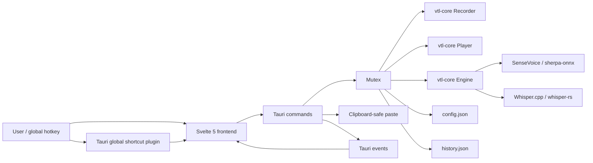
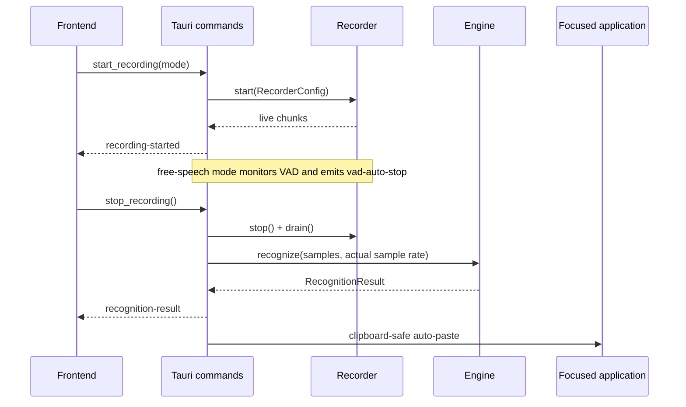

# Voice-typeless Architecture

> Version: v1.0-current
> Last reviewed: 2026-06-11
> Status: reflects the indexed Rust/Tauri/Svelte implementation

## 1. System Overview

Voice-typeless is a Tauri v2 desktop application with a Svelte 5 frontend and a reusable Rust core crate. Speech recognition runs locally after a model is available. The application may use the network to download a missing model, but captured audio and recognition requests are not sent to a cloud service.


```mermaid
flowchart LR
    User["User / global hotkey"] --> Frontend["Svelte 5 frontend"]
    User --> Shortcut["Tauri global shortcut plugin"]
    Frontend --> Commands["Tauri commands"]
    Shortcut --> Frontend
    Commands --> State["Mutex<AppState>"]
    State --> Recorder["vtl-core Recorder"]
    State --> Player["vtl-core Player"]
    State --> Engine["vtl-core Engine"]
    Engine --> SenseVoice["SenseVoice / sherpa-onnx"]
    Engine --> Whisper["Whisper.cpp / whisper-rs"]
    Commands --> Paste["Clipboard-safe paste"]
    Commands --> Events["Tauri events"]
    Events --> Frontend
    State --> Config["config.json"]
    State --> History["history.json"]
```

## 2. Layer Boundaries

| Layer | Location | Responsibility |
|---|---|---|
| Frontend | `frontend/` | Settings, device/model UI, recording state, history UI, typed command wrappers, event listeners |
| Desktop bridge | `src-tauri/` | App lifecycle, global shortcuts, tray, commands, model acquisition, persistence coordination |
| Reusable core | `core-rs/` | Audio capture, VAD, playback, engine abstraction, recognition, paste, config, text processing, SQLite history abstraction |
| Assets and tooling | `models/`, `build/`, `scripts/` | Model conversion metadata, packaging, environment setup, development launchers |

The Tauri crate depends directly on `vtl-core` through a path dependency. There is no sidecar process or JSON-RPC boundary.

## 3. Application Lifecycle

`src-tauri/src/lib.rs::run` is the main composition root. It:

1. Installs the shell and global-shortcut plugins.
2. Resolves portable or installed data paths.
3. Loads `AppConfig` and JSON history.
4. Creates the recorder and cue player.
5. Registers configured push-to-talk, free-speech, and cancel shortcuts.
6. Attempts to load the configured speech model.
7. Starts a background model download when required.
8. Stores runtime dependencies in `Mutex<AppState>`.
9. Creates the system tray and registers Tauri commands.

The frontend polls engine and shortcut status after mount because setup events can occur before WebView listeners are ready.

## 4. Shared State

The current Tauri state is intentionally concrete:

```rust
pub struct AppState {
    config: AppConfig,
    history: Vec<HistoryItem>,
    history_path: PathBuf,
    recorder: Recorder,
    player: Player,
    engine: Option<Box<dyn Engine>>,
    hotkey_registration: Vec<serde_json::Value>,
}
```

Tauri wraps this value in `std::sync::Mutex`. Commands should keep lock duration short, especially around audio and model work. Reusable business logic belongs in `vtl-core`; platform orchestration remains in `src-tauri`.

## 5. Recording And Recognition


```mermaid
sequenceDiagram
    participant UI as Frontend
    participant CMD as Tauri commands
    participant REC as Recorder
    participant ASR as Engine
    participant OS as Focused application

    UI->>CMD: start_recording(mode)
    CMD->>REC: start(RecorderConfig)
    REC-->>CMD: live chunks
    CMD-->>UI: recording-started
    Note over CMD,REC: free-speech mode monitors VAD and emits vad-auto-stop
    UI->>CMD: stop_recording()
    CMD->>REC: stop() + drain()
    CMD->>ASR: recognize(samples, actual sample rate)
    ASR-->>CMD: RecognitionResult
    CMD-->>UI: recognition-result
    CMD->>OS: clipboard-safe auto-paste
```

Important implementation details:

- The recorder reports the device's actual sample rate with drained audio.
- SenseVoice resamples to 16 kHz when necessary.
- Free-speech mode uses VAD and a default three-second silence timeout.
- Cancellation stops capture and emits state changes without recognition.
- Auto-paste is best effort; paste errors do not suppress the recognition result.

## 6. Engine Abstraction

`core-rs/src/engine/traits.rs` defines the shared contract:

```rust
pub trait Engine: Send {
    fn load_model(&mut self, cfg: ModelConfig) -> Result<(), EngineError>;
    fn recognize(&mut self, audio: &[f32], sample_rate: u32)
        -> Result<RecognitionResult, EngineError>;
    fn model_info(&self) -> ModelInfo;
    fn close(&mut self) -> Result<(), EngineError>;
    fn is_loaded(&self) -> bool;
}
```

Implementations:

| Engine | Feature | Backend |
|---|---|---|
| `SenseVoiceEngine` | `engine-sensevoice` (default) | `sherpa-onnx` |
| `WhisperCppEngine` | `engine-whisper-cpp` | `whisper-rs` |

`src-tauri/src/engine_loader.rs` maps the active model ID to an engine type, resolves model files, selects the configured device, and loads the model. Model load failure is represented as `None` in `AppState` and exposed to the frontend through status/events.

## 7. Core Modules

| Module | Current role |
|---|---|
| `audio` | cpal input stream, device enumeration, sample buffering, cue playback, VAD |
| `engine` | Model types, engine trait, SenseVoice and Whisper.cpp implementations |
| `config` | Structured app configuration, defaults, load/save, portable path override |
| `hotkey` | Hotkey action types and key-combination parsing |
| `paste` | Clipboard preservation and platform paste behavior |
| `processor` | Filler filtering, mixed-language normalization, dictionary replacement, capitalization |
| `history` | SQLite-backed `HistoryStore` abstraction and implementation |

`TextProcessor` and the SQLite `HistoryStore` are tested reusable core capabilities, but they are not currently connected to the active `stop_recording` path. The desktop app currently keeps history as JSON-backed `Vec<HistoryItem>`. Wiring these modules into the runtime should be treated as a separate migration with compatibility tests.

## 8. Persistence

Installed mode stores application data under the platform data directory. Portable mode stores data beside the executable.

| Data | Current storage | Owner |
|---|---|---|
| App configuration | `config.json` | `vtl_core::config` |
| Desktop history | `history.json` | `src-tauri/history_io.rs` |
| Downloaded models | `models/` below the resolved data directory | `src-tauri/model_downloader.rs` |
| Reusable core history | SQLite database when explicitly instantiated | `core-rs/history.rs` |

Model binaries are excluded from Git. The repository tracks only model metadata, export tooling, tokens, license material, and small test WAV files.

## 9. Frontend Contract

`frontend/src/lib/tauri/commands.ts` is the typed command boundary. `events.ts` registers native event listeners, while `appState.svelte.ts` holds UI state.

Command groups include:

- Recording: start, stop, cancel, paste
- Devices and models: enumerate devices, switch device/model, retry engine, inspect status
- History: list, delete, clear, export, statistics
- Configuration: get/set config, autostart
- Development: demo mode

The Rust command name, TypeScript wrapper name, payload shape, and event name must change together.

## 10. Project Structure

```text
Voice-typeless/
|-- AGENTS.md                  # Agent workflow and MCP instructions
|-- core-rs/                   # Reusable Rust crate
|   |-- src/audio/
|   |-- src/engine/
|   |-- src/config.rs
|   |-- src/history.rs
|   |-- src/hotkey.rs
|   |-- src/paste.rs
|   `-- src/processor.rs
|-- frontend/                  # Svelte 5 + Vite
|   `-- src/lib/               # Components, stores, Tauri wrappers, i18n
|-- src-tauri/                 # Desktop composition and native commands
|   `-- src/                   # State, commands, model and persistence helpers
|-- models/                    # Model tooling and tracked metadata
|-- plugins/                   # Future plugin surface
|-- build/                     # Windows/macOS packaging scripts
|-- scripts/                   # Setup, MSVC environment, dev launcher
|-- tests/                     # E2E test area
|-- docs/                      # Product, architecture, API, graph, lessons
`-- .codebase-memory/          # Shareable compressed knowledge graph
```

Build outputs under `core-rs/target`, `src-tauri/target`, frontend output, `dist`, model binaries, and local agent screenshots are ignored and must not be committed.

## 11. Build And Validation

Windows development:

```powershell
. .\scripts\env-msvc.ps1
.\scripts\setup.ps1
.\scripts\dev.ps1
```

Acceptance checks:

```powershell
Push-Location core-rs
cargo fmt --check
cargo test
cargo clippy --all-targets -- -D warnings
Pop-Location

Push-Location frontend
npm run check
npm run build
Pop-Location

Push-Location src-tauri
cargo fmt --check
cargo check
Pop-Location
```

Hardware microphone and full model integration tests may require local devices and model files; they should remain explicitly identifiable as environment-dependent tests.

## 12. Current Risks And Next Boundaries

| Area | Current risk or incomplete boundary |
|---|---|
| Runtime processing | `TextProcessor` is not yet applied to recognition output |
| History | Tauri JSON history and core SQLite history are parallel implementations |
| Model acquisition | First-run download requires network access despite offline inference |
| GPU execution | Provider selection exists, but each packaged backend needs platform validation |
| Platform support | Windows is the primary verified target; macOS and Win7 need dedicated acceptance passes |
| Large composition root | `src-tauri/src/lib.rs::run` owns many concerns and should be split only with focused tests |

## 13. Architecture Decisions

1. **Rust core instead of a sidecar**: direct calls reduce packaging complexity and keep reusable logic type-safe.
2. **Trait-based speech engines**: model implementations remain replaceable behind one runtime contract.
3. **Tauri as composition layer**: OS lifecycle and UI IPC stay out of the reusable core.
4. **Portable and installed paths**: one binary supports both deployment styles through path resolution.
5. **Committed knowledge graph**: `.codebase-memory/graph.db.zst` is versioned so agents can inspect the same architecture snapshot.

See [`knowledge-graph.md`](knowledge-graph.md) for graph statistics, hotspots, and the generated runtime map.
