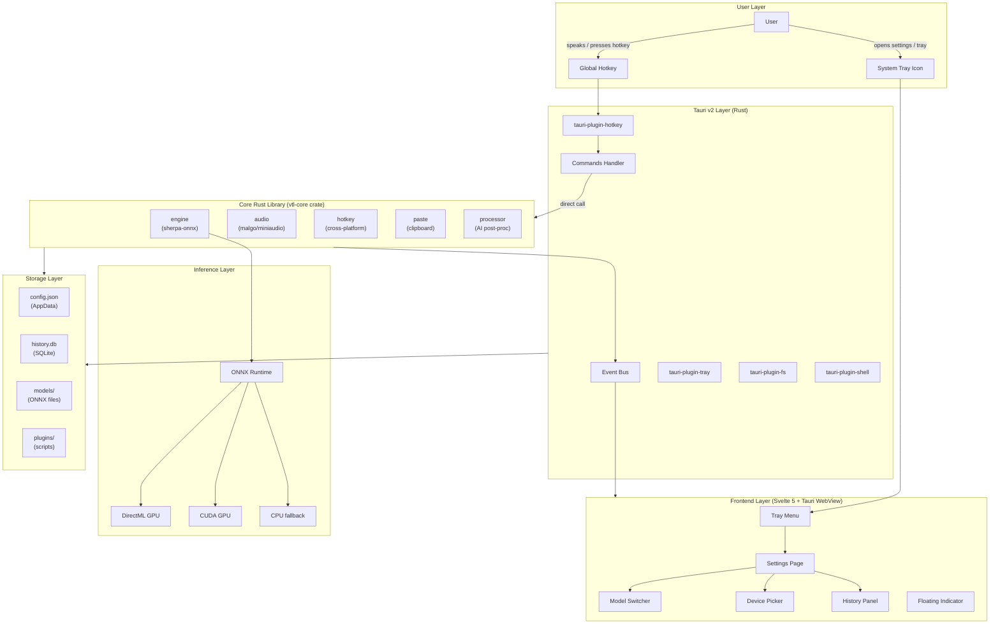
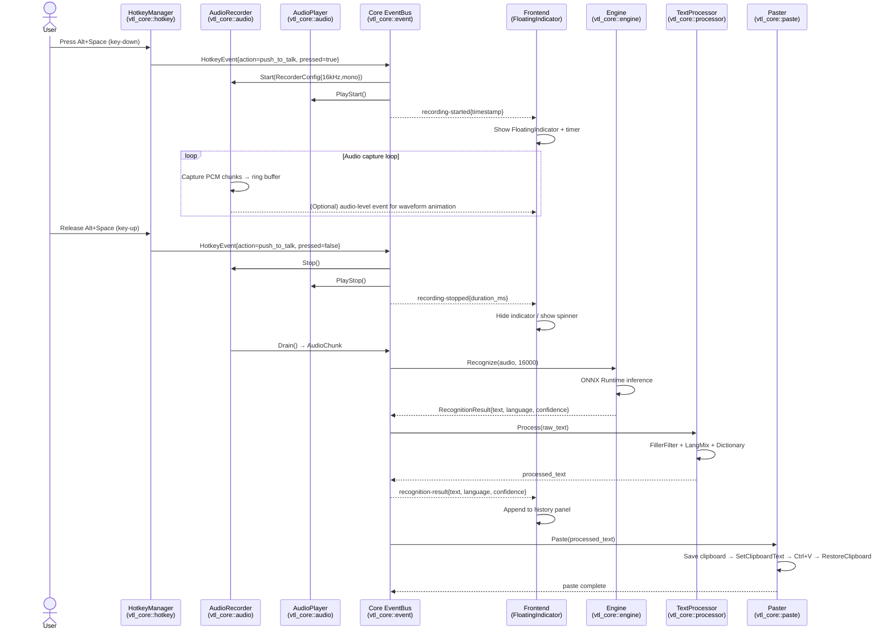
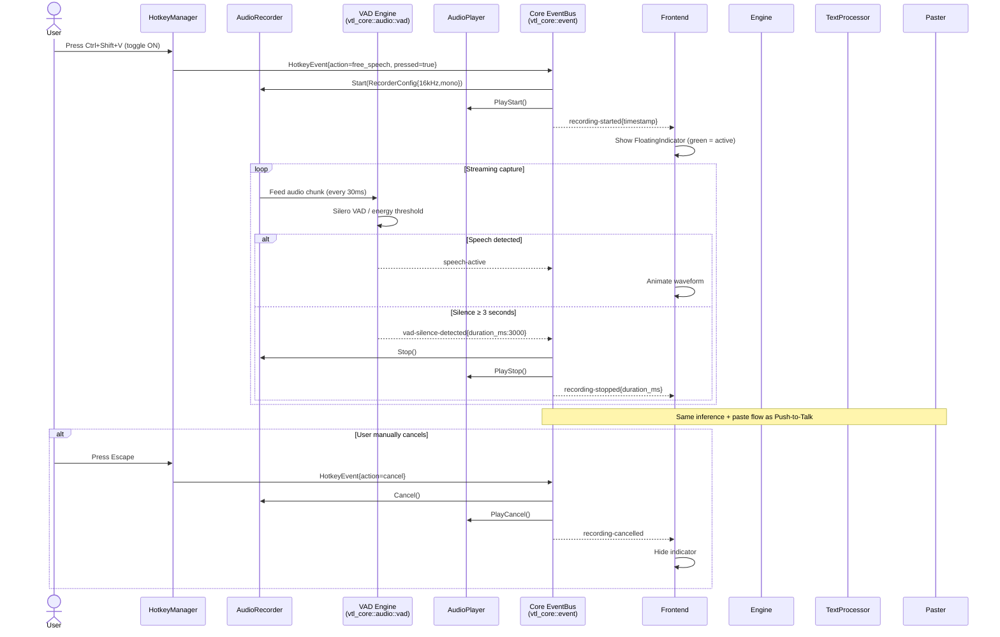
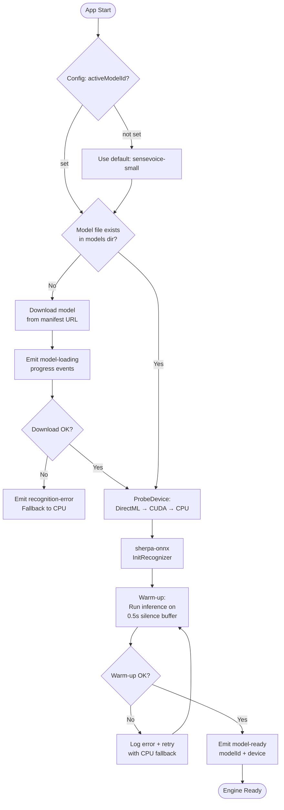

# Voice-typeless (VTL) — Architecture Document

> **版本**：v1.0-draft  
> **作者**：Architect Agent  
> **最後更新**：2026-04-21  
> **狀態**：APPROVED — Core Agent / Frontend Agent 可據此實作

---

## Table of Contents

1. [System Overview](#1-system-overview)
2. [Project Structure Explanation](#2-project-structure-explanation)
3. [Core Rust Library (vtl-core) API Overview](#3-core-rust-library-vtl-core-api-overview)
4. [Tauri Command & Event API (vtl-core ↔ Frontend)](#4-tauri-command--event-api)
5. [Data Flow Diagrams](#5-data-flow-diagrams)
6. [Configuration Schema](#6-configuration-schema)
7. [Audio Pipeline](#7-audio-pipeline)
8. [Model Architecture](#8-model-architecture)
9. [Clipboard Protection Design](#9-clipboard-protection-design)
10. [Plugin System Architecture](#10-plugin-system-architecture)
11. [Windows 7 Compatibility Layer](#11-windows-7-compatibility-layer)
12. [Technology Decision Log](#12-technology-decision-log)
13. [Dependency Graph](#13-dependency-graph)

---

## 1. System Overview

### 1.1 High-Level Architecture


```mermaid
graph TB
    subgraph UserLayer["User Layer"]
        U[User] -->|"speaks / presses hotkey"| HK[Global Hotkey]
        U -->|"opens settings / tray"| TI[System Tray Icon]
    end

    subgraph FrontendLayer["Frontend Layer (Svelte 5 + Tauri WebView)"]
        TI --> TrayMenu[Tray Menu]
        TrayMenu --> SettingsUI[Settings Page]
        SettingsUI --> ModelSwitcher[Model Switcher]
        SettingsUI --> DevicePicker[Device Picker]
        SettingsUI --> HistoryPanel[History Panel]
        FloatingIndicator[Floating Indicator]
    end

    subgraph TauriLayer["Tauri v2 Layer (Rust)"]
        CMD[Commands Handler]
        EVT[Event Bus]
        PluginHotkey[tauri-plugin-hotkey]
        PluginTray[tauri-plugin-tray]
        PluginFS[tauri-plugin-fs]
        PluginShell[tauri-plugin-shell]
    end

    subgraph CoreLayer["Core Rust Library (vtl-core crate)"]
        AudioMod["audio\n(malgo/miniaudio)"]
        EngineMod["engine\n(sherpa-onnx)"]
        HotkeyMod["hotkey\n(cross-platform)"]
        PasteMod["paste\n(clipboard)"]
        ProcessorMod["processor\n(AI post-proc)"]
    end

    subgraph InferenceLayer["Inference Layer"]
        ONNX[ONNX Runtime]
        DirectML[DirectML GPU]
        CUDA[CUDA GPU]
        CPU[CPU fallback]
        ONNX --> DirectML
        ONNX --> CUDA
        ONNX --> CPU
    end

    subgraph StorageLayer["Storage Layer"]
        ConfigFile["config.json\n(AppData)"]
        HistoryDB["history.db\n(SQLite)"]
        ModelsDir["models/\n(ONNX files)"]
        PluginsDir["plugins/\n(scripts)"]
    end

    HK --> PluginHotkey
    PluginHotkey --> CMD
    CMD -->|"direct call"| CoreLayer
    EVT --> FrontendLayer
    CoreLayer --> EVT
    EngineMod --> ONNX
    CoreLayer --> StorageLayer
    TauriLayer --> StorageLayer
```

### 1.2 Component Responsibilities

| Component | Layer | Responsibility | Boundary |
|-----------|-------|---------------|----------|
| **Svelte 5 Frontend** | Frontend | All user-visible UI: settings, tray menu, floating indicator, history panel | Pure UI, no business logic |
| **Tauri v2 Runtime** | Bridge | WebView host, native window management, OS integration | Thin bridge only; no recognition logic |
| **Tauri Plugins** | Bridge | Global hotkey capture, system tray, file system access, shell commands | Platform-specific OS calls |
| **core-rs/audio** | Core Library | Microphone enumeration, PCM capture at 16 kHz mono, ring buffer, VAD | Only audio I/O — no inference |
| **core-rs/engine** | Core Library | sherpa-onnx lifecycle, model loading, GPU/CPU dispatch, streaming inference | Only speech recognition — no UI |
| **core-rs/hotkey** | Core Library | Cross-platform hotkey registration fallback (used when Tauri plugin unavailable) | Platform abstraction |
| **core-rs/paste** | Core Library | Clipboard save/restore, simulated keyboard paste, per-platform API | Only clipboard & paste |
| **core-rs/processor** | Core Library | Filler-word filter, punctuation restoration, language mixing normalization, custom dictionary | Only text post-processing |
| **models/** | Storage | ONNX model files, metadata JSON, download manager | Passive file store |
| **plugins/** | Extension | User scripts loaded at runtime; transform recognition results | Sandboxed; no system access |

### 1.3 Why Tauri v2 over Wails v3

| Criterion | Tauri v2 | Wails v3 | Decision |
|-----------|----------|----------|----------|
| **WebView footprint** | Uses OS WebView (< 1 MB added) | Bundles Chromium or OS WebView | Tauri ✅ |
| **Security model** | Rust core + explicit capability permissions per command | Go runtime, weaker sandbox | Tauri ✅ |
| **Plugin ecosystem** | Official plugin registry (hotkey, tray, fs, updater, etc.) | Manual integration required | Tauri ✅ |
| **Core integration** | Rust `vtl-core` as workspace dep | Go is the host runtime | Tauri wins — no IPC overhead |
| **Cross-platform** | Windows / macOS / Linux tier-1 | Same | Tie |
| **Auto-updater** | `tauri-plugin-updater` built-in | Third-party | Tauri ✅ |
| **Bundle size** | ~3–8 MB installer | ~5–15 MB | Tauri ✅ |

**Decision**: Tauri v2 with `vtl-core` as a **Rust workspace dependency** (`core-rs/` crate). Tauri commands import and call `vtl-core` functions directly — no sidecar process, no IPC, no CGO. This eliminates serialisation overhead, simplifies error handling, and reduces the binary footprint by removing the Go runtime. The `vtl-core` crate is designed as an independent library that can be embedded into other Rust projects without Tauri.

---

## 2. Project Structure Explanation

```
Voice-typeless/
├── core-rs/                     # Independent Rust library (crate: vtl-core)
│   ├── src/
│   │   ├── lib.rs               # Public API: re-exports all public types + trait objects
│   │   ├── engine/
│   │   │   ├── mod.rs           # Speech engine abstraction — sherpa-onnx wrapper
│   │   │   ├── sensevoice.rs    # SenseVoice model implementation
│   │   │   ├── whisper.rs       # Whisper-tiny model implementation
│   │   │   ├── custom_onnx.rs   # Generic ONNX model loader
│   │   │   ├── device.rs        # GPU/CPU device selection algorithm
│   │   │   └── warmup.rs        # Model warm-up strategy
│   │   ├── audio/
│   │   │   ├── mod.rs           # Recording + sound effects (malgo/miniaudio)
│   │   │   ├── recorder.rs      # AudioRecorder implementation
│   │   │   ├── player.rs        # AudioPlayer (marimba sounds)
│   │   │   ├── devices.rs       # DeviceEnumerator
│   │   │   ├── ringbuf.rs       # Lock-free ring buffer
│   │   │   ├── vad.rs           # Voice Activity Detection
│   │   │   └── sounds/          # Embedded sound files (.ogg) — build.rs embeds
│   │   ├── hotkey/
│   │   │   ├── mod.rs           # Cross-platform hotkey manager
│   │   │   ├── windows.rs       # Windows RegisterHotKey API
│   │   │   ├── darwin.rs        # macOS Carbon/Cocoa hotkey
│   │   │   └── combo.rs         # Key combo parsing
│   │   ├── paste/
│   │   │   ├── mod.rs           # Paste + clipboard protection
│   │   │   ├── windows.rs       # SendInput + OpenClipboard
│   │   │   ├── darwin.rs        # NSPasteboard + CGEvent
│   │   │   └── guard.rs         # ClipboardGuard (save/restore)
│   │   ├── processor/
│   │   │   ├── mod.rs           # TextProcessor pipeline
│   │   │   ├── filler.rs        # FillerWordFilter (zh + en + ja + ko)
│   │   │   ├── punctuation.rs   # Punctuation restoration
│   │   │   ├── language_mix.rs  # Mixed-language space normalization
│   │   │   └── dictionary.rs    # Custom dictionary replacement
│   │   ├── config.rs            # AppConfig struct + Load/Save (serde)
│   │   ├── history.rs           # SQLite history store
│   │   └── state.rs             # AppState — shared Arc<RwLock<...>> for Tauri commands
│   ├── Cargo.toml               # vtl-core: default-features + dirs
│   ├── build.rs                 # Embed sound files & model metadata
│   └── tests/                   # Unit & integration tests
│       ├── engine_tests.rs
│       ├── audio_tests.rs
│       ├── paste_tests.rs
│       ├── processor_tests.rs
│       └── hotkey_tests.rs
│
├── frontend/                    # Svelte 5 + Vite frontend
│   ├── src/
│   │   ├── routes/              # SvelteKit pages (if SvelteKit; else flat components)
│   │   ├── components/
│   │   │   ├── FloatingIndicator.svelte
│   │   │   ├── HistoryPanel.svelte
│   │   │   ├── SettingsPage.svelte
│   │   │   ├── ModelSwitcher.svelte
│   │   │   └── DevicePicker.svelte
│   │   ├── stores/              # Svelte 5 runes-based stores
│   │   ├── lib/
│   │   │   ├── tauri.ts         # Typed Tauri command wrappers
│   │   │   └── events.ts        # Typed event listeners
│   │   ├── styles/
│   │   │   └── globals.css      # TailwindCSS + VTL design tokens
│   │   └── app.ts               # Entry point
│   ├── package.json
│   ├── vite.config.ts
│   ├── tailwind.config.ts
│   └── tsconfig.json
│
├── src-tauri/                   # Tauri Rust application (depends on vtl-core)
│   ├── src/
│   │   ├── main.rs              # Tauri application bootstrap
│   │   ├── commands.rs          # #[tauri::command] handlers (calls vtl-core directly)
│   │   ├── state.rs             # Tauri State<AppState> wiring
│   │   ├── tray.rs              # System tray setup
│   │   └── updater.rs           # Auto-update logic
│   ├── icons/                   # App icons (all resolutions)
│   ├── capabilities/            # Tauri v2 capability JSON files
│   └── tauri.conf.json          # Tauri configuration
│
├── plugins/                     # User plugin scripts
│   ├── README.md                # Plugin API documentation
│   └── examples/
│       ├── uppercase.js         # Example: transform to uppercase
│       └── code_format.lua      # Example: code mode formatting
│
├── models/                      # Speech model files
│   ├── manifest.json            # Available models metadata
│   └── sensevoice-small/        # Default bundled model
│       ├── model.onnx
│       └── meta.json
│
├── docs/                        # Documentation
│   ├── agents.md                # Multi-agent specification
│   ├── architecture.md          # This file
│   └── api.md                   # Public API reference
│
├── build/                       # Build scripts
│   ├── build_windows.ps1        # Full Windows (10/11) build
│   ├── build_win7.ps1           # Win7 slim build (CPU only)
│   ├── build_macos.sh           # macOS build + notarization
│   └── Makefile                 # Cross-platform make targets
│
├── scripts/                     # Dev helper scripts
│   ├── download_models.ps1      # Pre-download default models
│   ├── gen_icons.sh             # Generate icon variants
│   └── check_deps.ps1           # Verify dev environment
│
└── tests/                       # E2E tests
    ├── e2e/                     # Playwright-based E2E
    └── fixtures/                # Audio fixture files (.wav)
```

---

## 3. Core Rust Library (vtl-core) API Overview

> All modules live under the `vtl-core` crate (`core-rs/`). Each module exports only public types and trait objects via `lib.rs`; implementation details are private. The Rust code uses `#[async_trait]`, `Arc<T>`, and `serde` derives for type-safe, async-first APIs.


### 3.1 core-rs/src/engine

```rust
// core-rs/src/engine/mod.rs — vtl-core engine module

use std::time::Duration;
use serde::{Deserialize, Serialize};

/// Identifies the speech recognition model variant.
#[derive(Debug, Clone, Serialize, Deserialize, PartialEq)]
pub enum ModelType {
    SenseVoice,
    WhisperTiny,
    CustomOnnx(String),
}

/// Specifies the inference hardware target.
#[derive(Debug, Clone, Serialize, Deserialize, PartialEq)]
pub enum DeviceType {
    Auto,      // Probe DirectML → CUDA → CPU
    DirectML,  // Windows DirectML (GPU)
    Cuda,      // NVIDIA CUDA
    Cpu,       // CPU-only fallback
}

/// Carries all parameters needed to initialise a model.
#[derive(Debug, Clone, Serialize, Deserialize)]
pub struct ModelConfig {
    pub model_type: ModelType,
    pub model_path: String,     // Absolute path to .onnx file
    pub tokens_path: String,    // Path to tokens.txt (sherpa-onnx)
    pub device: DeviceType,
    pub language: String,       // "auto", "zh", "en", "ja", "ko", ...
    pub num_threads: usize,     // 0 = auto (half of available cores)
}

/// Output of a single inference pass.
#[derive(Debug, Clone, Serialize, Deserialize)]
pub struct RecognitionResult {
    pub text: String,
    pub language: String,        // Detected language code
    pub confidence: f64,         // 0.0–1.0
    pub duration: Duration,      // Audio duration processed
    pub segments: Vec<Segment>,  // Word-level timestamps
}

/// A timed word or phrase within a result.
#[derive(Debug, Clone, Serialize, Deserialize)]
pub struct Segment {
    pub text: String,
    pub start: Duration,
    pub end: Duration,
}

/// Primary trait for speech recognition.
/// Implementations must be `Send + Sync` for concurrent use after `load_model`.
#[async_trait::async_trait]
pub trait Engine: Send + Sync {
    /// LoadModel initialises the model and warms up the inference session.
    /// Must be called exactly once before `recognize`.
    async fn load_model(&mut self, cfg: ModelConfig) -> Result<(), Box<dyn std::error::Error>>;

    /// Recognize performs inference on a complete audio buffer.
    /// `audio` must be 16 kHz, mono, normalised f32 in [-1.0, 1.0].
    async fn recognize(&self, audio: &[f32], sample_rate: u32) -> Result<RecognitionResult, Box<dyn std::error::Error>>;

    /// Metadata about the currently loaded model.
    fn model_info(&self) -> ModelInfo;
}

/// Describes a loaded or available model.
#[derive(Debug, Clone, Serialize, Deserialize)]
pub struct ModelInfo {
    pub id: String,
    pub model_type: ModelType,
    pub name: String,
    pub description: String,
    pub size_bytes: u64,
    pub languages: Vec<String>,
    pub device: DeviceType,
}

/// Creates an Engine for the given model type.
pub fn new_engine(model_type: &ModelType) -> Result<Box<dyn Engine>, Box<dyn std::error::Error>> {
    // Factory dispatches to per-model implementations
    Err("not implemented — use specific engine constructor".into())
}

/// Probes the best available DeviceType on the current system.
pub fn probe_device() -> DeviceType {
    // See device.rs for platform-specific probing logic
    DeviceType::Cpu
}
```

### 3.2 core-rs/src/audio

```rust
// core-rs/src/audio/mod.rs — vtl-core audio module

use std::time::Duration;
use serde::{Deserialize, Serialize};
use tokio::sync::broadcast;

/// Canonical sample rate required by sherpa-onnx.
pub const SAMPLE_RATE: u32 = 16_000;

/// Describes a physical audio input device.
#[derive(Debug, Clone, Serialize, Deserialize)]
pub struct DeviceInfo {
    pub id: String,
    pub name: String,
    pub is_default: bool,
    pub channels: u16,
    pub sample_rates: Vec<u32>,
}

/// Configuration for an AudioRecorder session.
#[derive(Debug, Clone)]
pub struct RecorderConfig {
    pub device_id: String, // "" or "default" → system default
    pub sample_rate: u32,  // Must be 16000 for direct engine use
    pub channels: u16,     // 1 = mono (required); 2 = stereo (downmixed internally)
    pub buffer_size: usize,// Ring buffer size in samples (0 = 16000*30 = 30 s)
}

impl Default for RecorderConfig {
    fn default() -> Self {
        Self {
            device_id: "default".into(),
            sample_rate: SAMPLE_RATE,
            channels: 1,
            buffer_size: (SAMPLE_RATE as usize) * 30,
        }
    }
}

/// A slice of PCM samples with metadata.
#[derive(Debug, Clone)]
pub struct AudioChunk {
    pub samples: Vec<f32>,
    pub sample_rate: u32,
    pub captured_at: std::time::Instant,
}

/// Captures microphone input using malgo (miniaudio) internally.
#[async_trait::async_trait]
pub trait AudioRecorder: Send + Sync {
    /// Start begins audio capture.
    async fn start(&mut self, cfg: RecorderConfig) -> Result<(), Box<dyn std::error::Error>>;

    /// Stop ends capture and flushes the ring buffer.
    async fn stop(&mut self) -> Result<AudioChunk, Box<dyn std::error::Error>>;

    /// Cancel ends capture and discards buffered audio.
    async fn cancel(&mut self);

    /// Subscribe returns a receiver for real-time audio chunks.
    /// Call before start. The sender is closed when stop/cancel is called.
    fn subscribe(&mut self) -> broadcast::Receiver<AudioChunk>;
}

/// Plays short notification sounds (non-blocking).
#[async_trait::async_trait]
pub trait AudioPlayer: Send + Sync {
    async fn play_start(&self) -> Result<(), Box<dyn std::error::Error>>;
    async fn play_stop(&self) -> Result<(), Box<dyn std::error::Error>>;
    async fn play_cancel(&self) -> Result<(), Box<dyn std::error::Error>>;
    fn set_enabled(&mut self, enabled: bool);
    fn set_volume(&mut self, volume: f64);  // 0.0–1.0
}

/// Lists available audio input devices.
pub trait DeviceEnumerator: Send + Sync {
    fn list_input_devices(&self) -> Result<Vec<DeviceInfo>, Box<dyn std::error::Error>>;
    fn default_input_device(&self) -> Result<DeviceInfo, Box<dyn std::error::Error>>;
}

pub fn new_recorder() -> impl AudioRecorder { /* sees malgo-sys */ }
pub fn new_player() -> impl AudioPlayer { /* sees malgo-sys */ }
pub fn new_enumerator() -> impl DeviceEnumerator { /* sees malgo-sys */ }
```

### 3.3 core-rs/src/hotkey

```rust
// core-rs/src/hotkey/mod.rs — vtl-core hotkey module

use bitflags::bitflags;
use serde::{Deserialize, Serialize};
use tokio::sync::mpsc;

bitflags! {
    /// Keyboard modifier key bitmask.
    #[derive(Debug, Clone, Serialize, Deserialize)]
    pub struct Modifier: u32 {
        const NONE  = 0;
        const CTRL  = 1 << 0;
        const SHIFT = 1 << 1;
        const ALT   = 1 << 2;
        const SUPER = 1 << 3; // Win / Cmd key
    }
}

/// A hotkey combination.
#[derive(Debug, Clone, Serialize, Deserialize)]
pub struct KeyCombo {
    pub modifiers: Modifier,
    pub key: String, // e.g. "Space", "V", "F1"
}

impl KeyCombo {
    /// Parses a human-readable combo string like "Alt+Space".
    pub fn parse(s: &str) -> Result<Self, String> {
        Err("not implemented — see hotkey/parser.rs".into())
    }
}

impl std::fmt::Display for KeyCombo {
    fn fmt(&self, f: &mut std::fmt::Formatter<'_>) -> std::fmt::Result {
        write!(f, "{:?}+{}", self.modifiers, self.key)
    }
}

/// Identifies which action a hotkey triggers.
#[derive(Debug, Clone, Serialize, Deserialize, PartialEq)]
pub enum HotkeyAction {
    PushToTalk,
    FreeSpeech,
    Cancel,
}

/// Emitted when a registered hotkey is pressed or released.
#[derive(Debug, Clone)]
pub struct HotkeyEvent {
    pub action: HotkeyAction,
    pub pressed: bool, // true = key down, false = key up
    pub combo: KeyCombo,
}

/// Maps actions to key combinations.
#[derive(Debug, Clone, Serialize, Deserialize)]
pub struct HotkeyConfig {
    pub push_to_talk: KeyCombo,
    pub free_speech: KeyCombo,
    pub cancel: KeyCombo,
}

/// Registers global hotkeys and emits events.
/// Platform-specific: Windows → RegisterHotKey, macOS → Carbon.
#[async_trait::async_trait]
pub trait HotkeyManager: Send + Sync {
    /// Register all hotkeys in config.
    async fn register(&mut self, cfg: HotkeyConfig) -> Result<(), Box<dyn std::error::Error>>;

    /// Unregister releases all registered hotkeys.
    async fn unregister(&mut self) -> Result<(), Box<dyn std::error::Error>>;

    /// Events returns a receiver for HotkeyEvents (capacity 16).
    fn events(&mut self) -> mpsc::Receiver<HotkeyEvent>;

    /// Run blocks and processes OS hotkey messages until cancelled.
    async fn run(&mut self) -> Result<(), Box<dyn std::error::Error>>;
}

/// Creates a platform-appropriate HotkeyManager.
pub fn new_hotkey_manager() -> impl HotkeyManager {
    // Platform-specific factory
}
```

### 3.4 core-rs/src/paste

```go
// core-rs/src/paste/mod.rs — vtl-core paste module

use serde::{Deserialize, Serialize};
use std::time::Duration;

/// Selects how text is inserted into the target application.
#[derive(Debug, Clone, Serialize, Deserialize, PartialEq)]
pub enum PasteMethod {
    /// Save text to clipboard, send Ctrl+V / Cmd+V.
    Clipboard,
    /// Send each character via synthetic keyboard events.
    /// Slower but works in apps that intercept clipboard paste.
    SendInput,
}

/// Configures a Paster instance.
#[derive(Debug, Clone, Serialize, Deserialize)]
pub struct PasteConfig {
    pub method: PasteMethod,
    /// Minimum ms to hold clipboard before restoring (default 150).
    pub clipboard_hold_ms: u64,
    /// Whether to restore previous clipboard content.
    pub restore_clipboard: bool,
}

impl Default for PasteConfig {
    fn default() -> Self {
        Self {
            method: PasteMethod::Clipboard,
            clipboard_hold_ms: 150,
            restore_clipboard: true,
        }
    }
}

/// Inserts text into the currently focused application.
#[async_trait::async_trait]
pub trait Paster: Send + Sync {
    /// Paste inserts text using the configured method.
    async fn paste(&self, text: &str) -> Result<(), Box<dyn std::error::Error>>;
    fn configure(&mut self, cfg: PasteConfig);
}

/// Saves and restores clipboard contents around a paste operation.
pub trait ClipboardGuard: Send + Sync {
    fn save(&mut self) -> Result<(), Box<dyn std::error::Error>>;
    fn restore(&mut self) -> Result<(), Box<dyn std::error::Error>>;
    fn hold_duration(&self) -> Duration;
}

pub fn new_paster(cfg: PasteConfig) -> impl Paster { /* platform factory */ }
pub fn new_clipboard_guard(hold: Duration) -> impl ClipboardGuard { /* platform factory */ }
```

### 3.5 core-rs/src/processor

```go
// core-rs/src/processor/mod.rs — vtl-core processor module

use serde::{Deserialize, Serialize};

/// Configures the text post-processing pipeline.
#[derive(Debug, Clone, Serialize, Deserialize)]
pub struct ProcessorConfig {
    pub language: String,              // "auto", "zh", "en", ...
    pub filter_filler_words: bool,
    pub mixed_language_optimization: bool, // Insert spaces at CJK/Latin boundaries
    pub capitalize_sentences: bool,        // Capitalise first letter of sentences
    pub restore_punctuation: bool,         // AI-based punctuation restoration
    pub custom_dictionary: Vec<DictionaryEntry>,
}

/// Maps a recognised phrase to a preferred output form.
#[derive(Debug, Clone, Serialize, Deserialize)]
pub struct DictionaryEntry {
    pub input: String,  // What the model may output, e.g. "a i"
    pub output: String, // What to replace it with, e.g. "AI"
}

/// Main post-processing pipeline.
/// Processors are composable: each stage receives the output of the previous one.
pub trait TextProcessor: Send + Sync {
    /// Process applies the full configured pipeline to raw recognised text.
    fn process(&self, raw: &str) -> Result<String, Box<dyn std::error::Error>>;
    fn configure(&mut self, cfg: ProcessorConfig);
}

/// Removes spoken filler words from recognised text.
/// Built-in lists: zh (那個/就是/嗯/啊), en (um/uh/like/you know),
/// ja (えーと/あの), ko (음/어).
pub trait FillerWordFilter: Send + Sync {
    fn filter(&self, text: &str, language: &str) -> String;
    fn add_custom(&mut self, word: String, language: String);
}

pub fn new_text_processor(cfg: ProcessorConfig) -> impl TextProcessor { /* impl */ }
pub fn new_filler_word_filter() -> impl FillerWordFilter { /* impl */ }
```

---

## 4. Tauri Command & Event API (vtl-core ↔ Frontend)

The `vtl-core` crate is a **Rust workspace dependency** of `src-tauri/`. Tauri commands call `vtl-core` functions directly — no sidecar process, no IPC serialisation, no JSON-RPC. The shared `AppState` (`Arc<RwLock<CoreState>>`) is registered with `tauri::Builder::manage()` and injected into each command via `tauri::State<'_, AppState>`.

### 4.1 Tauri Commands (Frontend → vtl-core)

All commands are invoked via `invoke(commandName, payload)` from the frontend.

```typescript
// frontend/src/lib/tauri.ts — typed wrappers

import { invoke } from "@tauri-apps/api/core";
import type {
  RecognitionResult,
  DeviceList,
  HistoryItem,
  AppConfig,
  ModelInfo,
} from "./types";

/** Begin audio capture. */
export async function startRecording(
  mode: "push_to_talk" | "free_speech"
): Promise<void> {
  return invoke("start_recording", { mode });
}

/** Stop capture and return the recognition result. */
export async function stopRecording(): Promise<RecognitionResult> {
  return invoke("stop_recording");
}

/** Cancel capture without returning a result. */
export async function cancelRecording(): Promise<void> {
  return invoke("cancel_recording");
}

/** Return all available audio input devices. */
export async function getDevices(): Promise<DeviceList> {
  return invoke("get_devices");
}

/** Select the active recording device. */
export async function setDevice(deviceId: string): Promise<void> {
  return invoke("set_device", { deviceId });
}

/** Retrieve recognition history. */
export async function getHistory(limit: number): Promise<HistoryItem[]> {
  return invoke("get_history", { limit });
}

/** Delete a single history entry. */
export async function deleteHistoryItem(id: string): Promise<void> {
  return invoke("delete_history_item", { id });
}

/** Get the full application configuration. */
export async function getConfig(): Promise<AppConfig> {
  return invoke("get_config");
}

/** Persist a partial configuration update. */
export async function setConfig(config: Partial<AppConfig>): Promise<void> {
  return invoke("set_config", { config });
}

/** List all available speech models. */
export async function getModels(): Promise<ModelInfo[]> {
  return invoke("get_models");
}

/** Switch the active speech model by ID. Triggers model-loading events. */
export async function switchModel(modelId: string): Promise<void> {
  return invoke("switch_model", { modelId });
}
```

#### Rust Command Signatures (src-tauri/src/commands.rs)

Commands receive `tauri::State<'_, AppState>` instead of a sidecar client. `AppState` wraps `vtl-core`'s `CoreState` in `Arc<RwLock<...>>` for shared mutation across async commands.

```rust
// Each command calls vtl-core directly via AppState.

use vtl_core::{
    AppConfig, DeviceList, HistoryItem, ModelInfo, RecognitionResult,
    self as core,
};

pub struct AppState {
    pub core: Arc<tokio::sync::RwLock<core::CoreState>>,
}

#[tauri::command]
async fn start_recording(
    mode: String,
    state: tauri::State<'_, AppState>,
) -> Result<(), String> {
    let mut core = state.core.write().await;
    core.start_recording(&mode).map_err(|e| e.to_string())
}

#[tauri::command]
async fn stop_recording(
    state: tauri::State<'_, AppState>,
) -> Result<RecognitionResult, String> {
    let mut core = state.core.write().await;
    core.stop_recording().map_err(|e| e.to_string())
}

#[tauri::command]
async fn cancel_recording(
    state: tauri::State<'_, AppState>,
) -> Result<(), String> {
    let mut core = state.core.write().await;
    core.cancel_recording().map_err(|e| e.to_string())
}

#[tauri::command]
async fn get_devices(
    state: tauri::State<'_, AppState>,
) -> Result<DeviceList, String> {
    let core = state.core.read().await;
    core.get_devices().map_err(|e| e.to_string())
}

#[tauri::command]
async fn set_device(
    device_id: String,
    state: tauri::State<'_, AppState>,
) -> Result<(), String> {
    let mut core = state.core.write().await;
    core.set_device(&device_id).map_err(|e| e.to_string())
}

#[tauri::command]
async fn get_history(
    limit: u32,
    state: tauri::State<'_, AppState>,
) -> Result<Vec<HistoryItem>, String> {
    let core = state.core.read().await;
    core.get_history(limit).map_err(|e| e.to_string())
}

#[tauri::command]
async fn delete_history_item(
    id: String,
    state: tauri::State<'_, AppState>,
) -> Result<(), String> {
    let mut core = state.core.write().await;
    core.delete_history_item(&id).map_err(|e| e.to_string())
}

#[tauri::command]
async fn get_config(
    state: tauri::State<'_, AppState>,
) -> Result<AppConfig, String> {
    let core = state.core.read().await;
    Ok(core.get_config().clone())
}

#[tauri::command]
async fn set_config(
    config: serde_json::Value,
    state: tauri::State<'_, AppState>,
) -> Result<(), String> {
    let mut core = state.core.write().await;
    core.set_config(config).map_err(|e| e.to_string())
}

#[tauri::command]
async fn get_models(
    state: tauri::State<'_, AppState>,
) -> Result<Vec<ModelInfo>, String> {
    let core = state.core.read().await;
    core.get_models().map_err(|e| e.to_string())
}

#[tauri::command]
async fn switch_model(
    model_id: String,
    state: tauri::State<'_, AppState>,
) -> Result<(), String> {
    let mut core = state.core.write().await;
    core.switch_model(&model_id).await.map_err(|e| e.to_string())
}
```

### 4.2 Tauri Events (vtl-core → Frontend)

Events are emitted by `vtl-core` directly via a shared `EventEmitter` (integrated with Tauri's global event system at startup). The frontend listens with the same typed wrappers.

```typescript
// frontend/src/lib/events.ts — typed event listeners

import { listen, type UnlistenFn } from "@tauri-apps/api/event";

export interface RecordingStartedPayload {
  timestamp: number; // Unix ms
}

export interface RecordingStoppedPayload {
  duration_ms: number;
}

export interface RecognitionResultPayload {
  text: string;
  language: string;
  confidence: number;
  segments?: Array<{ text: string; start_ms: number; end_ms: number }>;
}

export interface RecognitionErrorPayload {
  message: string;
  code: string; // e.g. "MODEL_NOT_LOADED", "AUDIO_DEVICE_ERROR"
}

export interface ModelLoadingPayload {
  progress: number; // 0.0–1.0
  stage: "download" | "load" | "warmup";
}

export interface ModelReadyPayload {
  modelId: string;
  device: "directml" | "cuda" | "cpu";
}

export interface VadSilencePayload {
  duration_ms: number;
}

export async function onRecordingStarted(
  cb: (p: RecordingStartedPayload) => void
): Promise<UnlistenFn> {
  return listen<RecordingStartedPayload>("recording-started", (e) => cb(e.payload));
}

export async function onRecordingStopped(
  cb: (p: RecordingStoppedPayload) => void
): Promise<UnlistenFn> {
  return listen<RecordingStoppedPayload>("recording-stopped", (e) => cb(e.payload));
}

export async function onRecognitionResult(
  cb: (p: RecognitionResultPayload) => void
): Promise<UnlistenFn> {
  return listen<RecognitionResultPayload>("recognition-result", (e) => cb(e.payload));
}

export async function onRecognitionError(
  cb: (p: RecognitionErrorPayload) => void
): Promise<UnlistenFn> {
  return listen<RecognitionErrorPayload>("recognition-error", (e) => cb(e.payload));
}

export async function onModelLoading(
  cb: (p: ModelLoadingPayload) => void
): Promise<UnlistenFn> {
  return listen<ModelLoadingPayload>("model-loading", (e) => cb(e.payload));
}

export async function onModelReady(
  cb: (p: ModelReadyPayload) => void
): Promise<UnlistenFn> {
  return listen<ModelReadyPayload>("model-ready", (e) => cb(e.payload));
}

export async function onVadSilence(
  cb: (p: VadSilencePayload) => void
): Promise<UnlistenFn> {
  return listen<VadSilencePayload>("vad-silence-detected", (e) => cb(e.payload));
}
```

### 4.3 Architecture: Direct Call vs. Sidecar IPC

The current architecture uses direct Rust function calls instead of a sidecar process:

| Concern | Sidecar (original) | Direct Call (current) |
|---------|-------------------|----------------------|
| **Communication** | JSON-RPC over named pipe / Unix socket | Rust function calls via `vtl-core` API |
| **Serialisation** | JSON encode/decode per call | Zero-copy (same process, same address space) |
| **State sharing** | Separate process, must re-read config from disk | `Arc<RwLock<CoreState>>` shared in-memory |
| **Crash isolation** | Sidecar can restart independently | Process crashes with app (trade-off for simplicity) |
| **Startup** | Tauri spawns sidecar, waits for IPC connect | `vtl-core::CoreState::new()` runs synchronously in `main.rs` |
| **Latency overhead** | ~1–5 ms per call (IPC round-trip) | < 0.01 ms per call (same-thread dispatch) |
| **Binary size** | + ~50 MB (Go runtime + std library) | Zero added (pure Rust) |
| **Build complexity** | Cross-compile Go + generate CGO bindings | Single `cargo build` |

### 4.4 Shared TypeScript Types

```typescript
// frontend/src/lib/types.ts

export interface RecognitionResult {
  text: string;
  language: string;
  confidence: number;
  duration_ms: number;
  segments?: Segment[];
}

export interface Segment {
  text: string;
  start_ms: number;
  end_ms: number;
}

export interface DeviceInfo {
  id: string;
  name: string;
  is_default: boolean;
}

export interface DeviceList {
  devices: DeviceInfo[];
  active_device_id: string;
}

export interface HistoryItem {
  id: string;
  text: string;
  language: string;
  confidence: number;
  duration_ms: number;
  created_at: number; // Unix ms
}

export interface ModelInfo {
  id: string;
  name: string;
  type: "sensevoice" | "whisper-tiny" | "custom-onnx";
  size_bytes: number;
  languages: string[];
  is_active: boolean;
  is_downloaded: boolean;
  device: "directml" | "cuda" | "cpu" | null;
}
```

---

## 5. Data Flow Diagrams

### 5.1 Push-to-Talk Flow


```mermaid
sequenceDiagram
    actor User
    participant HK as HotkeyManager<br/>(vtl_core::hotkey)
    participant AR as AudioRecorder<br/>(vtl_core::audio)
    participant AP as AudioPlayer<br/>(vtl_core::audio)
    participant EV as Core EventBus<br/>(vtl_core::event)
    participant FE as Frontend<br/>(FloatingIndicator)
    participant ENG as Engine<br/>(vtl_core::engine)
    participant PROC as TextProcessor<br/>(vtl_core::processor)
    participant PST as Paster<br/>(vtl_core::paste)

    User->>HK: Press Alt+Space (key-down)
    HK->>EV: HotkeyEvent{action=push_to_talk, pressed=true}
    EV->>AR: Start(RecorderConfig{16kHz,mono})
    EV->>AP: PlayStart()
    EV-->>FE: recording-started{timestamp}
    FE->>FE: Show FloatingIndicator + timer

    loop Audio capture loop
        AR->>AR: Capture PCM chunks → ring buffer
        AR-->>FE: (Optional) audio-level event for waveform animation
    end

    User->>HK: Release Alt+Space (key-up)
    HK->>EV: HotkeyEvent{action=push_to_talk, pressed=false}
    EV->>AR: Stop()
    EV->>AP: PlayStop()
    EV-->>FE: recording-stopped{duration_ms}
    FE->>FE: Hide indicator / show spinner

    AR->>EV: Drain() → AudioChunk
    EV->>ENG: Recognize(audio, 16000)
    ENG->>ENG: ONNX Runtime inference
    ENG-->>EV: RecognitionResult{text, language, confidence}

    EV->>PROC: Process(raw_text)
    PROC->>PROC: FillerFilter + LangMix + Dictionary
    PROC-->>EV: processed_text

    EV-->>FE: recognition-result{text, language, confidence}
    FE->>FE: Append to history panel

    EV->>PST: Paste(processed_text)
    PST->>PST: Save clipboard → SetClipboardText → Ctrl+V → RestoreClipboard
    PST-->>EV: paste complete
```

### 5.2 Free-Speech Flow (with VAD auto-stop)


```mermaid
sequenceDiagram
    actor User
    participant HK as HotkeyManager
    participant AR as AudioRecorder
    participant VAD as VAD Engine<br/>(vtl_core::audio::vad)
    participant AP as AudioPlayer
    participant EV as Core EventBus<br/>(vtl_core::event)
    participant FE as Frontend
    participant ENG as Engine
    participant PROC as TextProcessor
    participant PST as Paster

    User->>HK: Press Ctrl+Shift+V (toggle ON)
    HK->>EV: HotkeyEvent{action=free_speech, pressed=true}
    EV->>AR: Start(RecorderConfig{16kHz,mono})
    EV->>AP: PlayStart()
    EV-->>FE: recording-started{timestamp}
    FE->>FE: Show FloatingIndicator (green = active)

    loop Streaming capture
        AR->>VAD: Feed audio chunk (every 30ms)
        VAD->>VAD: Silero VAD / energy threshold
        alt Speech detected
            VAD-->>EV: speech-active
            FE->>FE: Animate waveform
        else Silence ≥ 3 seconds
            VAD-->>EV: vad-silence-detected{duration_ms:3000}
            EV->>AR: Stop()
            EV->>AP: PlayStop()
            EV-->>FE: recording-stopped{duration_ms}
        end
    end

    Note over EV,PST: Same inference + paste flow as Push-to-Talk

    alt User manually cancels
        User->>HK: Press Escape
        HK->>EV: HotkeyEvent{action=cancel}
        EV->>AR: Cancel()
        EV->>AP: PlayCancel()
        EV-->>FE: recording-cancelled
        FE->>FE: Hide indicator
    end
```

### 5.3 Model Loading Flow


```mermaid
flowchart TD
    A([App Start]) --> B{Config: activeModelId?}
    B -- "not set" --> C[Use default: sensevoice-small]
    B -- "set" --> D{Model file exists\nin models dir?}
    C --> D
    D -- "No" --> E[Download model\nfrom manifest URL]
    E --> F[Emit model-loading\nprogress events]
    F --> G{Download OK?}
    G -- "No" --> H[Emit recognition-error\nFallback to CPU]
    G -- "Yes" --> I
    D -- "Yes" --> I[ProbeDevice:\nDirectML → CUDA → CPU]
    I --> J[sherpa-onnx\nInitRecognizer]
    J --> K[Warm-up:\nRun inference on\n0.5s silence buffer]
    K --> L{Warm-up OK?}
    L -- "No" --> M[Log error + retry\nwith CPU fallback]
    M --> K
    L -- "Yes" --> N[Emit model-ready\nmodelId + device]
    N --> O([Engine Ready])
```

---

## 6. Configuration Schema

### 6.1 TypeScript Interface (Source of Truth)

```typescript
// frontend/src/lib/types.ts (AppConfig section)

export interface HotkeyConfig {
  /** Human-readable combo, e.g. "Alt+Space". Parsed by vtl_core::hotkey::KeyCombo::parse. */
  pushToTalk: string;
  freeSpeech: string;
  cancel: string;
}

export interface AudioConfig {
  /** Device ID string or "default". */
  deviceId: string;
  /** 16000 for speech; 44100 for high-quality capture (downsampled internally). */
  sampleRate: 16000 | 44100;
  channels: 1 | 2;
  enableSounds: boolean;
  /** Volume 0.0–1.0 for notification sounds. */
  soundVolume: number;
}

export interface ModelConfig {
  activeModelId: string;
  /** Absolute path. Defaults to {appData}/vtl/models. */
  modelsDir: string;
  /** "auto" probes DirectML → CUDA → CPU at startup. */
  device: "auto" | "directml" | "cuda" | "cpu";
}

export type SupportedLanguage =
  | "auto"
  | "zh"
  | "en"
  | "ja"
  | "ko"
  | "fr"
  | "de"
  | "es"
  | "ru"
  | "it"
  | "pt";

export interface TextConfig {
  language: SupportedLanguage;
  filterFillerWords: boolean;
  /** Insert spaces at CJK/Latin boundaries; capitalize after sentence end. */
  mixedLanguageOptimization: boolean;
  /** User-defined replacement pairs: { input: "a i", output: "AI" }. */
  customDictionary: Array<{ input: string; output: string }>;
  /** Max silence before auto-stop in free-speech mode (ms). Default 3000. */
  vadSilenceThresholdMs: number;
}

export interface IndicatorPosition {
  x: number;
  y: number;
  /** Which display the indicator was last seen on (for multi-monitor). */
  displayId?: string;
}

export interface UIConfig {
  theme: "dark" | "light" | "system";
  /** UI display language. */
  language: "zh" | "en";
  showFloatingIndicator: boolean;
  indicatorPosition: IndicatorPosition;
  /** How many days to retain history items. 0 = forever. */
  historyRetentionDays: number;
  /** Maximum number of history items to store. */
  maxHistoryItems: number;
}

export interface SystemConfig {
  autoStart: boolean;
  minimizeToTray: boolean;
  /** Check GitHub releases for updates at startup. */
  checkUpdates: boolean;
  /** Log level: "debug" | "info" | "warn" | "error" */
  logLevel: string;
}

export interface AppConfig {
  /** Config file schema version for migration. */
  version: number;
  hotkey: HotkeyConfig;
  audio: AudioConfig;
  model: ModelConfig;
  text: TextConfig;
  ui: UIConfig;
  system: SystemConfig;
}
```

### 6.2 Default Values (Rust)

```rust
// core-rs/src/config/defaults.rs

use crate::config::{AppConfig, HotkeyConfig, AudioConfig, /* ... */};

impl Default for AppConfig {
    fn default() -> Self {
        Self {
            version: 1,
            hotkey: HotkeyConfig {
                push_to_talk: "Alt+Space".into(),
                free_speech: "Ctrl+Shift+V".into(),
                cancel: "Escape".into(),
            },
            audio: AudioConfig {
                device_id: "default".into(),
                sample_rate: 16000,
                channels: 1,
                enable_sounds: true,
                sound_volume: 0.8,
            },
        Model: ModelConfig{
            ActiveModelID: "sensevoice-small",
            ModelsDir:     "", // resolved to {AppData}/vtl/models at runtime
            Device:        "auto",
        },
        Text: TextConfig{
            Language:                    "auto",
            FilterFillerWords:           true,
            MixedLanguageOptimization:   true,
            CustomDictionary:            nil,
            VADSilenceThresholdMs:       3000,
        },
        UI: UIConfig{
            Theme:                 "system",
            Language:              "zh",
            ShowFloatingIndicator: true,
            IndicatorPosition:     IndicatorPosition{X: 100, Y: 100},
            HistoryRetentionDays:  30,
            MaxHistoryItems:       50,
        },
        System: SystemConfig{
            AutoStart:     false,
            MinimizeToTray: true,
            CheckUpdates:  true,
            LogLevel:      "info",
        },
    }
}
```

### 6.3 Config File Location

| Platform | Path |
|----------|------|
| Windows 10/11 | `%APPDATA%\vtl\config.json` |
| Windows 7 | `%APPDATA%\vtl\config.json` |
| macOS | `~/Library/Application Support/vtl/config.json` |

Config writes are **atomic**: write to `config.json.tmp` then rename to `config.json` to prevent corruption on crash.

---

## 7. Audio Pipeline

### 7.1 Pipeline Overview

```
Microphone (OS driver)
        │
        ▼
  malgo / miniaudio
  [Device: DeviceTypeCapture]
  [Format: FormatF32, Channels=1, SampleRate=16000]
        │
        ▼
  RingBuffer (lock-free, 30s @ 16kHz = 480,000 samples)
  ┌─────────────────────────────────────┐
  │  write_ptr ──────────► read_ptr     │
  │  (producer: malgo callback thread)  │
  │  (consumer: VAD goroutine)          │
  └─────────────────────────────────────┘
        │
        ├──► VAD goroutine
        │    [chunk size: 512 samples = 32ms]
        │    Silero VAD or energy threshold
        │    Emits: speech-active / vad-silence-detected
        │
        └──► Drain() on Stop()
             Returns full []float32 buffer
                    │
                    ▼
             sherpa-onnx Recognizer.AcceptWaveform()
                    │
                    ▼
             RecognitionResult{Text, Language, Confidence}
```

### 7.2 Device Enumeration and Selection

```rust
// Pseudocode — core-rs/src/audio/devices.rs

fn list_input_devices() -> Result<Vec<DeviceInfo>, Box<dyn std::error::Error>> {
    let ctx = malgo::Context::new(None, malgo::ContextConfig::default(), None)?;
    let infos = ctx.devices(malgo::DeviceType::Capture)?;
    // Map malgo::DeviceInfo → our DeviceInfo, flagging is_default
    Ok(devices)
}
```

**Sample rate handling**: If the physical device does not natively support 16 kHz, malgo's built-in resampler converts on the fly. The Core always receives 16 kHz float32 samples regardless of device capability.

**Channel downmix**: If `Channels=2` is configured (future stereo support), the recorder averages `(L+R)/2` per sample into mono before writing to the ring buffer.

### 7.3 Ring Buffer Design

```
Capacity: max(config.BufferSize, SampleRate * 30) = 480,000 samples
Implementation: []float32 with atomic read/write pointers
Thread safety:
  - One writer (malgo capture callback, called at OS audio thread priority)
  - One VAD reader + one Drain() reader (serialised by mutex at Drain time)
Overflow policy: Overwrite oldest samples (oldest audio is least important)
```

### 7.4 Voice Activity Detection (VAD)

Two VAD modes are supported:

| Mode | Algorithm | CPU Cost | Accuracy | When Used |
|------|-----------|----------|----------|-----------|
| **Energy** | RMS > threshold | Negligible | Medium | Win7 slim build, low-end CPUs |
| **Silero** | Silero VAD ONNX (1 MB model) | Low | High | Default on Win10+ |

```
VAD chunk processing loop (32ms chunks):
    chunk ← ring_buffer.read(512_samples)
    if mode == Silero:
        prob ← silero_vad.infer(chunk)   // returns 0.0–1.0
        is_speech ← prob > 0.5
    else:
        rms ← sqrt(mean(chunk²))
        is_speech ← rms > energy_threshold  // default 0.02

    if not is_speech:
        silence_duration += 32ms
        if silence_duration >= config.VADSilenceThresholdMs:
            emit vad-silence-detected
    else:
        silence_duration = 0
        emit speech-active
```

### 7.5 Audio Chunk Handoff to Inference

```rust
// src-tauri/src/commands.rs — Tauri command for stop_recording

#[tauri::command]
async fn stop_recording(
    state: tauri::State<'_, AppState>,
) -> Result<RecognitionResult, String> {
    let mut core = state.core.write().await;

    // Drain the audio ring buffer
    let chunk = core.drain_audio().map_err(|e| e.to_string())?;

    // Run inference (16 kHz float32 PCM)
    let mut result = core
        .recognize(&chunk.samples, chunk.sample_rate)
        .map_err(|e| e.to_string())?;

    // Apply post-processing pipeline (graceful degradation on error)
    let processed = core
        .processor()
        .process(&result.text)
        .unwrap_or(result.text.clone());
    result.text = processed;

    Ok(result)
}
```

---

## 8. Model Architecture

### 8.1 sherpa-onnx Initialization Strategy

```
Startup sequence:
1. Read config.Model.ActiveModelID
2. Resolve model path: {ModelsDir}/{modelID}/model.onnx
3. Check model file hash against {ModelsDir}/{modelID}/meta.json
4. ProbeDevice() → select hardware backend
5. Build sherpa_onnx.OfflineRecognizerConfig:
   - Model: SenseVoice or Transducer (Whisper)
   - Decoding method: "greedy_search" (fast) or "modified_beam_search" (accurate)
   - Provider: "dml" | "cuda" | "cpu"
   - NumThreads: runtime.NumCPU() / 2
6. NewOfflineRecognizer(config)
7. Warm-up: feed 0.5s silence → discard result → measure latency
8. Emit model-ready
```

### 8.2 DirectML / CUDA / CPU Device Selection Algorithm

```rust
// core-rs/src/engine/device.rs

pub fn probe_device() -> DeviceType {
    // 1. Check OS version (Win7 → skip DirectML)
    if is_windows_7() {
        return DeviceType::Cpu;
    }

    // 2. Try DirectML (Windows 10+ with any GPU)
    #[cfg(target_os = "windows")]
    if test_direct_ml() {
        return DeviceType::DirectML;
    }

    // 3. Try CUDA (any OS, NVIDIA GPU)
    if test_cuda() {
        return DeviceType::Cuda;
    }

    // 4. Fall back to CPU
    DeviceType::Cpu
}

fn test_direct_ml() -> bool {
    // Attempt to create a minimal ONNX Runtime session with DML provider.
    std::panic::catch_unwind(|| {
        // ... minimal session creation via sherpa-onnx-sys
    })
    .is_ok()
}
```

### 8.3 Model File Structure in `models/`

```
models/
├── manifest.json                  # Registry of all available models
├── sensevoice-small/              # Default bundled model (shipped with app)
│   ├── model.onnx                 # ONNX model weights (~65 MB)
│   ├── tokens.txt                 # Vocabulary / token map
│   ├── meta.json                  # Model metadata + SHA256 hash
│   └── README.md                  # Model license + attribution
├── whisper-tiny/                  # Optional downloadable model (~39 MB)
│   ├── encoder.onnx
│   ├── decoder.onnx
│   ├── tokens.txt
│   └── meta.json
└── custom-<uuid>/                 # User-imported custom models
    ├── model.onnx
    └── meta.json
```

**`manifest.json` schema**:

```json
{
  "version": 1,
  "models": [
    {
      "id": "sensevoice-small",
      "name": "SenseVoice Small",
      "type": "sensevoice",
      "version": "1.0.0",
      "size_bytes": 68157440,
      "sha256": "abc123...",
      "download_url": "https://releases.vtl.app/models/sensevoice-small-v1.tar.gz",
      "languages": ["zh", "en", "ja", "ko", "fr", "de", "es", "ru", "it", "pt"],
      "min_ram_mb": 256,
      "recommended_device": "auto"
    }
  ]
}
```

### 8.4 Adding New Models via Plugin/Model API

To register a new model:

1. Place ONNX file(s) in `models/{your-model-id}/`
2. Create `meta.json` with the model metadata (same schema as manifest entry)
3. Implement the `Engine` trait in `core-rs/src/engine/your_model.rs`
4. Register in `core-rs/src/engine/mod.rs` factory `new_engine()` function
5. Add entry to `models/manifest.json`

The `custom-onnx` model type provides a generic wrapper for any sherpa-onnx compatible ONNX model without code changes.

---

## 9. Clipboard Protection Design

### 9.1 Save / Restore Protocol

```
┌─────────────────────────────────────────────────────────────────┐
│  ClipboardGuard.Save()                                          │
│    Windows: OpenClipboard(NULL)                                 │
│             GetClipboardData(CF_UNICODETEXT) → savedText        │
│             GetClipboardData(CF_BITMAP)      → savedBitmap      │
│             CloseClipboard()                                    │
│    macOS:   NSPasteboard.generalPasteboard.string → savedText   │
└─────────────────────────────────────────────────────────────────┘
              │
              ▼
┌─────────────────────────────────────────────────────────────────┐
│  Paster.Paste(text)                                             │
│    Windows: OpenClipboard(NULL)                                 │
│             EmptyClipboard()                                    │
│             SetClipboardData(CF_UNICODETEXT, text)              │
│             CloseClipboard()                                    │
│             keybd_event(VK_CONTROL + VK_V) via SendInput        │
│    macOS:   NSPasteboard.generalPasteboard.setString(text)      │
│             CGEventPost(Cmd+V key event)                        │
└─────────────────────────────────────────────────────────────────┘
              │
              ▼  HOLD for min(ClipboardHoldMs, 150ms)
              │  — ensures target app has time to read clipboard —
              ▼
┌─────────────────────────────────────────────────────────────────┐
│  ClipboardGuard.Restore()                                       │
│    Windows: OpenClipboard(NULL)                                 │
│             EmptyClipboard()                                    │
│             if savedText != "" → SetClipboardData(CF_UNICODETEXT)│
│             if savedBitmap   → SetClipboardData(CF_BITMAP)      │
│             CloseClipboard()                                    │
│    macOS:   NSPasteboard.generalPasteboard.setString(savedText) │
└─────────────────────────────────────────────────────────────────┘
```

### 9.2 Race Condition Avoidance

- **Minimum hold time**: 150 ms (configurable via `ClipboardHoldMs`)
- **Retry logic**: If `OpenClipboard` returns `ERROR_ACCESS_DENIED` (another app has the clipboard), retry up to 5 times with 20 ms backoff
- **Empty clipboard handling**: If `savedText == ""` and `savedBitmap == nil`, skip restore entirely to avoid clearing the clipboard unnecessarily
- **Concurrent paste prevention**: A mutex in `Paster` ensures only one paste operation runs at a time; subsequent calls queue and wait

### 9.3 Platform Notes

| Platform | API | Notes |
|----------|-----|-------|
| Windows 10/11 | `OpenClipboard` / `SetClipboardData` / `CF_UNICODETEXT` | Works in all applications |
| Windows 7 | Same API | Same implementation; `CF_UNICODETEXT` is available since Win2000 |
| macOS 12+ | `NSPasteboard` + `CGEventPost` | Requires Accessibility permission |
| macOS < 12 | Same `NSPasteboard` API | `CGEventPost` available since macOS 10.4 |

---

## 10. Plugin System Architecture

### 10.1 Plugin Loading Mechanism

Plugins are scripts in `plugins/` that transform recognition results. The Core loads plugins at startup and re-loads on file change (hot-reload).

```
plugins/
├── my-transform.rhai    # Rhai plugin (rhai crate — Rust-native scripting)
├── code-format.lua      # Lua plugin (rlua crate)
└── disabled/            # Plugins in this subfolder are not loaded
```

### 10.2 Plugin Execution Model

```rust
// core-rs/src/processor/plugin_runner.rs (conceptual)

#[async_trait::async_trait]
pub trait Plugin: Send + Sync {
    /// Returns the plugin's identifier.
    fn name(&self) -> &str;

    /// Primary hook: receives post-processed text; returns final text.
    /// Must return within 500ms or the future is cancelled (timeout).
    async fn on_recognition_result(&self, text: &str, language: &str) -> Result<String, Box<dyn std::error::Error>>;
}
```

**Rhai plugins** (rhai crate — pure Rust, no V8/Node dependency):

```rust
// plugins/uppercase.rhai
fn on_recognition_result(text, language) {
    // Available API: vtl::log(msg), vtl::config_get(key)
    text.to_upper()
}
```

**Lua plugins** (rlua crate):

```lua
-- plugins/code_format.lua
function on_recognition_result(text, language)
  if language == "en" then
    -- Replace "function" with "func" for Rust code mode
    return text:gsub("function ", "fn ")
  end
  return text
end
```

### 10.3 Sandboxing Strategy

| Restriction | Rhai | Lua (rlua) |
|-------------|------|------------|
| File system access | ❌ Blocked (`File::open` sandboxed) | ❌ Blocked (`io.*` removed) |
| Network access | ❌ No socket/cURL hooks | ❌ No socket lib |
| OS commands | ❌ No `std::process::Command` | ❌ `os.execute` removed |
| CPU time limit | 500 ms timeout via `tokio::time::timeout` | 500 ms timeout via `tokio::time::timeout` |
| Memory limit | Recursion depth & statement limits | rlua max stack 100 |
| Allowed VTL API | `vtl::log`, `vtl::config_get` | `vtl.log`, `vtl.config_get` |

Plugin failures are **non-fatal**: if a plugin errors or times out, the original text is used and the error is logged.

### 10.4 Plugin Execution Order

```
Raw ASR output
      │
      ▼
core-rs/src/processor pipeline (filler filter, lang mix, punctuation)
      │
      ▼
Plugin 1 (alphabetical by filename)
      │
      ▼
Plugin 2
      │
      ▼
...
      │
      ▼
Final text → Paste
```

---

## 11. Windows 7 Compatibility Layer

### 11.1 Feature Availability Matrix

| Feature | Windows 10/11 | Windows 7 |
|---------|--------------|-----------|
| DirectML GPU inference | ✅ | ❌ Not available |
| CUDA inference | ✅ | ✅ (if NVIDIA driver supports) |
| CPU inference | ✅ | ✅ |
| Silero VAD | ✅ | ✅ (CPU, small model) |
| Tauri v2 WebView2 | ✅ | ❌ WebView2 requires Win8.1+ |
| Modern hotkey API | ✅ | ✅ (`RegisterHotKey` Win2000+) |
| System tray | ✅ | ✅ |
| Clipboard API | ✅ | ✅ |

**Win7 delivery**: Because Tauri v2 requires WebView2 (unavailable on Win7), the Win7 build uses a **standalone Rust binary + axum embedded HTTP server + system WebView via `wry` crate (fallback WebView implementation)**. The Core library (`core-rs`) is fully reused; only the UI host differs.

### 11.2 Win7 Slim Build Constraints

- **No DirectML**: `ProbeDevice()` returns `DeviceCPU` on Win7 (detected via `RtlGetVersion`)
- **No Tauri**: CLI wrapper + minimal embedded web UI (wry + axum)
- **CPU threads**: Default to `NumCPU` for faster inference on CPU
- **Model size**: Win7 bundle includes only `sensevoice-small` (65 MB); no download manager
- **No auto-update**: Manual download from GitHub Releases

### 11.3 Build Tags

```rust
// core-rs/src/engine/device_windows.rs
#[cfg(all(windows, not(feature = "win7")))]
fn is_windows_7() -> bool { false }
```

```rust
// core-rs/src/engine/device_win7.rs
#[cfg(feature = "win7")]
fn is_windows_7() -> bool { true }
```

Build commands:

```powershell
# Full Windows 10/11 build (with Tauri)
cargo tauri build

# Win7 slim build (Rust only, CPU inference, wry-based UI)
cargo build --features win7 -p vtl-win7
```

### 11.4 Win7 Specific Hotkey Implementation

On Win7, `tauri-plugin-hotkey` is unavailable. The `vtl-core::hotkey` module uses the classic Win32 `RegisterHotKey` / `MSG` loop directly via the `windows-sys` crate.

---

## 12. Technology Decision Log

### 12.1 Tauri v2 vs. Wails v3

| Criterion | Options | Decision | Rationale | Trade-offs |
|-----------|---------|----------|-----------|------------|
| Desktop framework | Tauri v2, Wails v3, Electron, Qt | **Tauri v2** | OS WebView minimises install size; Rust security model; official plugin ecosystem for hotkey, tray, updater | Lower Go ecosystem compatibility; Rust learning curve for team |

### 12.2 sherpa-onnx vs. whisper.cpp vs. vosk

| Criterion | sherpa-onnx | whisper.cpp | vosk |
|-----------|-------------|-------------|------|
| SenseVoice support | ✅ First-class | ❌ | ❌ |
| DirectML support | ✅ | ❌ | ❌ |
| Rust bindings | ✅ `sherpa-onnx-sys` | CGO only | N/A |
| Streaming | ✅ | Limited | ✅ |
| Model variety | High | Whisper only | Medium |
| **Decision** | ✅ **Selected** | ❌ | ❌ |

**Rationale**: sherpa-onnx is the only option that provides SenseVoice support, DirectML acceleration, and Rust bindings via `sherpa-onnx-sys` in a single library.

### 12.3 malgo vs. portaudio vs. oto

| Criterion | malgo (miniaudio) | portaudio | oto |
|-----------|-------------------|-----------|-----|
| CGO dependency | Minimal (1 header) | Full CGO | Pure Go |
| Device enumeration | ✅ Rich | ✅ | Limited |
| Win7 support | ✅ | ✅ | ✅ |
| Built-in resampler | ✅ | ❌ | ❌ |
| Loopback capture | ✅ | ❌ | ❌ |
| **Decision** | ✅ **Selected** | ❌ | ❌ |

**Rationale**: malgo includes a built-in resampler (critical for 16 kHz normalisation) and supports Win7 via WinMM backend.

### 12.4 Svelte 5 vs. React vs. Vue

| Criterion | Svelte 5 | React 19 | Vue 3 |
|-----------|----------|----------|-------|
| Bundle size | ~15 KB | ~45 KB | ~35 KB |
| Runes (fine-grained reactivity) | ✅ | ❌ (signals via lib) | ✅ Composition API |
| TypeScript | ✅ First-class | ✅ | ✅ |
| Tauri community adoption | Growing | Strong | Moderate |
| **Decision** | ✅ **Selected** | ❌ | ❌ |

**Rationale**: Svelte 5 runes match the event-driven nature of voice UI (reactive state changes on audio events); smallest bundle suits the lightweight philosophy.

### 12.5 vtl-core: Rust Crate vs. Go Sidecar

| Approach | Pros | Cons |
|----------|------|------|
| **Rust crate `vtl-core`** (selected) | Zero IPC overhead; single `cargo build`; same memory space; simpler error handling; no cross-compilation | Rust learning curve; no Go runtime benefits |
| Go sidecar + JSON-RPC | Process isolation | ~1 ms IPC latency; dual build system; larger binary (+~50 MB Go runtime) |

**Decision**: Rust crate. Eliminates serialisation overhead, simplifies the build pipeline, and reduces binary size by ~50 MB vs Go sidecar.

### 12.6 SQLite vs. JSON File for History

| Approach | Pros | Cons |
|----------|------|------|
| **SQLite** (selected) | Query, sort, delete, retention cleanup; future FTS | Adds `rusqlite` dep |
| JSON file | Zero deps; simple | No efficient query; file grows unbounded |

**Decision**: SQLite via `rusqlite` for structured history storage.

### 12.7 Plugin Runtime: Rhai + rlua vs. WebAssembly

| Approach | Pros | Cons |
|----------|------|------|
| **Rhai + rlua** (selected) | Familiar syntax; fast compile; Rust-native | Two runtimes to maintain |
| WASM (wasmtime) | Single runtime; better sandboxing | Complex plugin authoring; larger binary |

**Decision**: Rhai + rlua for v1. WASM migration path kept open for v2.

---

## 13. Dependency Graph

### 13.1 vtl-core Crate Dependency Tree (core-rs/)

```
vtl-core (core-rs/Cargo.toml)
├── sherpa-onnx-sys                           # Speech recognition (C bindings)
│   └── (bundles onnxruntime + sherpa-onnx C libs)
├── malgo-sys                                 # Audio capture/playback (miniaudio C bindings)
├── rusqlite                                  # History storage
├── rhai                                      # JavaScript-like plugin runtime
├── rlua                                      # Lua plugin runtime
├── windows-sys (Windows) / libc (Unix)       # Low-level OS APIs (hotkey, clipboard)
├── uuid                                      # UUID generation (history IDs)
├── serde + serde_json                        # Serialisation
├── tokio                                     # Async runtime
├── log                                       # Structured logging
└── thiserror                                 # Error derive

// Dev / test only
├── rstest                                    # Test fixtures
└── mockall                                   # Trait mocking
```

### 13.2 npm / Frontend Dependency Tree

```
frontend/
├── dependencies
│   ├── @tauri-apps/api@^2.0              # Tauri IPC (invoke, listen, etc.)
│   ├── @tauri-apps/plugin-hotkey@^2.0   # Global hotkey plugin
│   ├── @tauri-apps/plugin-fs@^2.0       # File system access
│   ├── @tauri-apps/plugin-shell@^2.0    # Shell command access (model downloader)
│   ├── @tauri-apps/plugin-updater@^2.0  # Auto-update UI
│   └── svelte@^5.0                      # UI framework
│
├── devDependencies
│   ├── vite@^5.0                         # Build tool
│   ├── @sveltejs/vite-plugin-svelte@^4.0 # Svelte Vite integration
│   ├── typescript@^5.4                   # Type checking
│   ├── tailwindcss@^3.4                  # Utility CSS
│   ├── autoprefixer@^10.4               # CSS vendor prefixing
│   ├── postcss@^8.4                     # CSS processing
│   ├── @playwright/test@^1.44           # E2E testing
│   └── vitest@^1.6                      # Unit testing
```

### 13.3 Rust (src-tauri) Dependency Tree

```
src-tauri/Cargo.toml
├── tauri@^2.0                  # Core Tauri runtime
├── tauri-build@^2.0            # Build-time codegen
├── vtl-core                    # Workspace dependency — core library
├── serde@^1.0                  # JSON serialisation
├── serde_json@^1.0             # JSON parsing
├── tokio@^1.0                  # Async runtime
├── tauri-plugin-hotkey@^2.0   # Global hotkey plugin
├── tauri-plugin-tray@^2.0     # System tray plugin
├── tauri-plugin-fs@^2.0       # File system plugin
└── tauri-plugin-updater@^2.0  # Auto-update plugin
```

---

## Appendix A: Error Code Reference

| Code | Meaning | Recovery |
|------|---------|----------|
| `MODEL_NOT_LOADED` | Engine.Recognize called before LoadModel | Load model first |
| `AUDIO_DEVICE_ERROR` | Microphone unavailable or permission denied | Show device picker |
| `AUDIO_DEVICE_NOT_FOUND` | Configured DeviceID no longer exists | Fall back to default |
| `INFERENCE_TIMEOUT` | Inference took > 10 s | Retry with CPU fallback |
| `CLIPBOARD_ACCESS_DENIED` | Another app locked the clipboard | Retry with backoff |
| `HOTKEY_ALREADY_REGISTERED` | Hotkey combo used by another app | Prompt user to choose different combo |
| `PLUGIN_TIMEOUT` | Plugin script exceeded 500 ms | Log error, use original text |
| `MODEL_HASH_MISMATCH` | Downloaded model file corrupted | Re-download |

## Appendix B: Performance Budget

| Operation | Target | Measured On |
|-----------|--------|-------------|
| Push-to-talk end-to-end latency | < 120 ms | RTX 3060 + DirectML |
| Push-to-talk latency (CPU) | < 400 ms | i7-10th gen, 8 cores |
| Model warm-up time | < 2 s | RTX 3060 |
| Model warm-up time (CPU) | < 5 s | i7-10th gen |
| UI frame rate (idle) | 60 fps | All platforms |
| Memory footprint (idle) | < 120 MB | Win10, sensevoice-small |
| Installer size | < 40 MB | Windows NSIS |

## Appendix C: Security Considerations

1. **No network access by Core**: The `vtl-core` crate has no outbound HTTP calls during recognition. All inference is local.
2. **Model integrity**: SHA256 hash checked on every load. Tampered models are rejected.
3. **Plugin sandboxing**: Plugins cannot access file system, network, or OS APIs (see §10.3).
4. **Clipboard contents**: Never logged. Clipboard save/restore operates in memory only.
5. **History database**: Stored in `%APPDATA%` (user-space, not world-readable). No encryption in v1 (planned for v2 via SQLCipher).
6. **Tauri capabilities**: Each command is explicitly allowed in `capabilities/*.json`. No wildcard permissions.
7. **Code signing**: Windows NSIS installer signed with EV certificate. macOS PKG notarised by Apple.

## Appendix D: Open Questions / Decisions Deferred to v1.1

| # | Question | Proposed Resolution |
|---|----------|---------------------|
| 1 | (Resolved) vtl-core is in-process — crash = app crash, handled by Rust error types | N/A — all errors propagate as typed `Result<T, CoreError>` |
| 2 | What is the maximum recording length in push-to-talk mode? | Cap at 30 s (ring buffer size). Longer sessions → streaming inference. |
| 3 | Should history be encrypted at rest? | SQLCipher integration planned for v1.1 |
| 4 | Streaming (partial) results for long free-speech sessions? | sherpa-onnx supports online recogniser; implement in v1.1 |
| 5 | WASM plugin runtime? | Evaluate wazero post-v1.0 (§12.7) |
| 6 | Linux support? | Tier-2 target; no blocking architectural changes needed |
| 7 | CLI / REST API mode? | `cmd/vtl-cli/` stub in Core; full REST in v1.1 |

---

---

## 14. v0.2.0 Feature Implementations

This section documents the ten features shipped in v0.2.0 and their implementation
boundaries across the Tauri (Rust) and Svelte (frontend) layers. All persistence is handled
directly by the `vtl-core` crate.

### 14.1 AppState — Shared In-Memory State

All v0.2.0 commands share application state through a single `AppState` struct managed by
Tauri's state management system.

```rust
// src-tauri/src/lib.rs

use std::sync::Mutex;

pub struct AppState {
    pub config: Mutex<AppConfig>,
    pub history: Mutex<Vec<HistoryItem>>,
}

// Registered at app startup:
app.manage(AppState {
    config: Mutex::new(load_config_or_default()),
    history: Mutex::new(load_history_or_empty()),
});
```

Commands acquire the appropriate mutex lock, perform their operation, and flush to disk
when the state changes. All disk writes are atomic (write to `.tmp` then rename).

---

### 14.2 Feature 1 — Persistent Config

**Storage**: `%APPDATA%\Roaming\VoiceTypeless\config.json`

**Commands**: `get_config`, `set_config`

**Behaviour**:
- On first launch, `config.json` does not exist. `get_config` returns the built-in
  `DefaultConfig()` and writes it to disk so subsequent launches are consistent.
- `set_config` performs a **deep merge** of the incoming `Partial<AppConfig>` into the
  current in-memory config, then atomically writes the full merged config to disk.
- Config writes are **atomic**: the new config is written to `config.json.tmp` then
  renamed to `config.json` to prevent corruption on crash.

```rust
#[tauri::command]
async fn get_config(state: tauri::State<'_, AppState>) -> Result<AppConfig, String> {
    Ok(state.config.lock().unwrap().clone())
}

#[tauri::command]
async fn set_config(
    config: serde_json::Value,
    state: tauri::State<'_, AppState>,
) -> Result<(), String> {
    let mut current = state.config.lock().unwrap();
    deep_merge(&mut current, config);
    write_config_atomic(&current).map_err(|e| format!("CONFIG_WRITE_FAILED: {e}"))
}
```

---

### 14.3 Feature 2 — Persistent History

**Storage**: `%APPDATA%\Roaming\VoiceTypeless\history.json`

**Commands**: `get_history`, `delete_history_item`

**Behaviour**:
- History is an append-only `Vec<HistoryItem>` in memory, loaded from `history.json`
  at startup.
- New items are prepended (newest-first) and the list is capped at
  `config.ui.maxHistoryItems` (default 50). Items exceeding the cap are silently dropped
  from the tail.
- Every mutation (append, delete, clear) flushes the entire array to `history.json`
  atomically.

> **v0.2.0 vs. architecture spec**: The long-term architecture (§12.6) specifies SQLite
> via `rusqlite` for scalability. v0.2.0 uses a JSON file to keep the
> implementation simple and dependency-free. The
> migration path to SQLite is non-breaking (same `HistoryItem` schema).

---

### 14.4 Feature 3 — Clear All History

**Command**: `clear_history`

Empties `state.history`, then writes an empty JSON array `[]` to `history.json`.
The operation is synchronous and irreversible.

```rust
#[tauri::command]
async fn clear_history(state: tauri::State<'_, AppState>) -> Result<(), String> {
    state.history.lock().unwrap().clear();
    write_history_atomic(&[]).map_err(|e| format!("HISTORY_WRITE_FAILED: {e}"))
}
```

The frontend shows a confirmation dialog before invoking this command.

---

### 14.5 Feature 4 — Export History to Clipboard

**Command**: `export_history_text`

Returns all history items as a newline-delimited string. Each line is formatted as:

```
[YYYY-MM-DD HH:MM:SS] <transcription text>
```

Timestamps are formatted in local time. The frontend writes the returned string to the
system clipboard using `@tauri-apps/plugin-clipboard-manager`.

---

### 14.6 Feature 5 — Search / Filter History (Frontend)

This feature is **entirely frontend-side** — no Tauri command is involved.

The `HistoryPanel` component holds the full `HistoryItem[]` in a Svelte 5 reactive
`$state()` variable. A search input updates a `$derived()` filtered view:

```svelte
<!-- frontend/src/lib/components/HistoryPanel.svelte -->
<script lang="ts">
  import type { HistoryItem } from "$lib/types";

  let items = $state<HistoryItem[]>([]);
  let query = $state("");

  const filtered = $derived(
    query.trim() === ""
      ? items
      : items.filter((i) =>
          i.text.toLowerCase().includes(query.toLowerCase())
        )
  );
</script>

<input bind:value={query} placeholder="Search history…" />
{#each filtered as item (item.id)}
  <!-- render item -->
{/each}
```

Filtering is instant (no debounce needed for ≤ 50 items).

---

### 14.7 Feature 6 — Statistics Panel

**Command**: `get_stats`

Computes and returns an `AppStats` object from the in-memory history array. Calculation
happens on every call — there is no cached stats object.

```rust
#[tauri::command]
async fn get_stats(state: tauri::State<'_, AppState>) -> Result<AppStats, String> {
    let history = state.history.lock().unwrap();
    let total_recordings = history.len() as u64;
    let total_characters = history.iter().map(|i| i.text.len() as u64).sum();
    let total_duration_ms = history.iter().map(|i| i.duration_ms).sum();
    let mut languages: HashMap<String, u64> = HashMap::new();
    for item in history.iter() {
        *languages.entry(item.language.clone()).or_insert(0) += 1;
    }
    Ok(AppStats { total_recordings, total_characters, total_duration_ms, languages })
}
```

---

### 14.8 Feature 7 — Demo Mode

**Command**: `run_demo`

Simulates a full recording cycle for UI testing and onboarding without requiring a
microphone or speech model.

**Sequence**:
1. Lock `AppState`
2. Emit `recording-started` event (via `app_handle.emit`)
3. `tokio::time::sleep(Duration::from_millis(1500))` — simulates audio capture
4. Emit `recording-stopped` event
5. Construct a hardcoded `RecognitionResult` (language `"en"`, confidence `1.0`)
6. Prepend the result to `state.history`
7. Flush `history.json`
8. Return the `RecognitionResult`

Demo results are indistinguishable from real results in the history store.

---

### 14.9 Feature 8 — Theme System

**Commands used**: `get_config` (read `ui.theme`), `set_config` (write `ui.theme`)

**Theme values**: `"dark"` | `"light"` | `"system"`

**Frontend implementation**:

```svelte
<!-- src/App.svelte (or layout) -->
<script lang="ts">
  import { invoke } from "@tauri-apps/api/core";
  import type { AppConfig } from "$lib/types";

  let theme = $state<"dark" | "light" | "system">("system");

  onMount(async () => {
    const cfg = await invoke<AppConfig>("get_config");
    theme = cfg.ui.theme;
    applyTheme(theme);
  });

  async function setTheme(t: typeof theme) {
    theme = t;
    applyTheme(t);
    await invoke("set_config", { config: { ui: { theme: t } } });
  }

  function applyTheme(t: typeof theme) {
    const prefersDark = window.matchMedia("(prefers-color-scheme: dark)").matches;
    const useDark = t === "dark" || (t === "system" && prefersDark);
    document.documentElement.classList.toggle("dark", useDark);
  }
</script>
```

TailwindCSS is configured for `darkMode: "class"`. The `"system"` value subscribes to
the `prefers-color-scheme` media query and updates in real time.

---

### 14.10 Feature 9 — Windows Autostart

**Commands**: `get_autostart_enabled`, `set_autostart_enabled`

**Registry key**: `HKCU\Software\Microsoft\Windows\CurrentVersion\Run\VoiceTypeless`

**Value**: Absolute path to the installed `voice-typeless.exe`

```rust
#[tauri::command]
async fn set_autostart_enabled(enabled: bool) -> Result<(), String> {
    #[cfg(target_os = "windows")]
    {
        use winreg::enums::*;
        use winreg::RegKey;
        let hkcu = RegKey::predef(HKEY_CURRENT_USER);
        let run = hkcu
            .open_subkey_with_flags(
                r"Software\Microsoft\Windows\CurrentVersion\Run",
                KEY_WRITE,
            )
            .map_err(|e| format!("AUTOSTART_REGISTRY_ERROR: {e}"))?;
        if enabled {
            let exe = std::env::current_exe()
                .map_err(|e| format!("AUTOSTART_REGISTRY_ERROR: {e}"))?;
            run.set_value("VoiceTypeless", &exe.to_string_lossy().as_ref())
                .map_err(|e| format!("AUTOSTART_REGISTRY_ERROR: {e}"))?;
        } else {
            let _ = run.delete_value("VoiceTypeless"); // ignore if not present
        }
        Ok(())
    }
    #[cfg(not(target_os = "windows"))]
    Err("AUTOSTART_NOT_SUPPORTED".into())
}
```

Callers should also call `set_config({ system: { autoStart: enabled } })` to keep
`config.json` in sync with the registry state.

---

### 14.11 Feature 10 — System Tray

**Plugin**: `tauri-plugin-tray`  
**Module**: `src-tauri/src/tray.rs`

**Behaviour**:
- On application startup, a tray icon is registered with a context menu containing two
  items: "Show / Hide" (toggles main window visibility) and "Quit".
- Clicking the tray icon itself also toggles the window.
- When the main window is closed (not quit), it hides to the tray instead of exiting.
  This is achieved by intercepting the `CloseRequested` window event.

```rust
// src-tauri/src/tray.rs

use tauri::{
    menu::{Menu, MenuItem},
    tray::{MouseButton, TrayIconBuilder, TrayIconEvent},
    AppHandle, Manager,
};

pub fn setup_tray(app: &AppHandle) -> tauri::Result<()> {
    let show_hide = MenuItem::with_id(app, "show_hide", "Show / Hide", true, None::<&str>)?;
    let quit = MenuItem::with_id(app, "quit", "Quit", true, None::<&str>)?;
    let menu = Menu::with_items(app, &[&show_hide, &quit])?;

    TrayIconBuilder::new()
        .icon(app.default_window_icon().unwrap().clone())
        .menu(&menu)
        .on_menu_event(|app, event| match event.id.as_ref() {
            "show_hide" => toggle_window(app),
            "quit" => app.exit(0),
            _ => {}
        })
        .on_tray_icon_event(|tray, event| {
            if let TrayIconEvent::Click { button: MouseButton::Left, .. } = event {
                toggle_window(tray.app_handle());
            }
        })
        .build(app)?;

    Ok(())
}

fn toggle_window(app: &AppHandle) {
    if let Some(window) = app.get_webview_window("main") {
        if window.is_visible().unwrap_or(false) {
            let _ = window.hide();
        } else {
            let _ = window.show();
            let _ = window.set_focus();
        }
    }
}
```

---

## 15. Data Storage

### 15.1 Storage Layout

All user data is stored in the Windows app-data directory under a dedicated folder:

| File | Purpose | Written by |
|------|---------|------------|
| `%APPDATA%\Roaming\VoiceTypeless\config.json` | Application settings | `set_config` Tauri command |
| `%APPDATA%\Roaming\VoiceTypeless\history.json` | Transcription history | `stop_recording`, `run_demo`, `delete_history_item`, `clear_history` |

> **Platform note**: On Windows, `%APPDATA%` resolves to `C:\Users\<user>\AppData\Roaming`.
> Tauri's `tauri::api::path::app_data_dir()` returns this path cross-platform.

### 15.2 config.json Schema

See [§6 Configuration Schema](#6-configuration-schema) for the full `AppConfig` TypeScript
interface; the Rust `DefaultConfig()` implementation follows the same schema.

**Example `config.json`**:

```json
{
  "version": 1,
  "hotkey": { "pushToTalk": "Alt+Space", "freeSpeech": "Ctrl+Shift+V", "cancel": "Escape" },
  "audio": { "deviceId": "default", "sampleRate": 16000, "channels": 1, "enableSounds": true, "soundVolume": 0.8 },
  "model": { "activeModelId": "sensevoice-small", "modelsDir": "", "device": "auto" },
  "text": { "language": "auto", "filterFillerWords": true, "mixedLanguageOptimization": true, "customDictionary": [], "vadSilenceThresholdMs": 3000 },
  "ui": { "theme": "system", "language": "zh", "showFloatingIndicator": true, "indicatorPosition": { "x": 100, "y": 100 }, "historyRetentionDays": 30, "maxHistoryItems": 50 },
  "system": { "autoStart": false, "minimizeToTray": true, "checkUpdates": true, "logLevel": "info" }
}
```

### 15.3 history.json Schema

History is stored as a top-level JSON array of `HistoryItem` objects:

```json
[
  {
    "id": "550e8400-e29b-41d4-a716-446655440000",
    "text": "Hello, this is a transcription result.",
    "language": "en",
    "confidence": 0.97,
    "duration_ms": 2300,
    "created_at": 1745236321000
  }
]
```

Items are ordered newest-first. The array is capped at `config.ui.maxHistoryItems`.

### 15.4 Atomic Write Protocol

Both files use the same write protocol to prevent corruption:

```
1. Serialise new state to JSON bytes
2. Write bytes to   <target>.tmp
3. Flush + sync     <target>.tmp to disk (fsync)
4. Rename           <target>.tmp → <target>    (atomic on NTFS)
```

If the process is killed between steps 2 and 4, the `.tmp` file is left on disk but the
original file is intact. On next startup, stale `.tmp` files are silently ignored.

---

## 16. Theme System

See [§14.9](#149-feature-8--theme-system) for the full implementation.

### 16.1 Theme Architecture

```
config.json (ui.theme)
      │
      │  read on startup via get_config
      ▼
  App.svelte — applyTheme()
      │
      ├── "dark"   → document.documentElement.classList.add("dark")
      ├── "light"  → document.documentElement.classList.remove("dark")
      └── "system" → subscribe to window.matchMedia("(prefers-color-scheme: dark)")
                           → re-evaluate and toggle "dark" class in real time
```

### 16.2 TailwindCSS Configuration

```javascript
// frontend/tailwind.config.ts
export default {
  darkMode: "class", // Controlled by adding/removing "dark" on <html>
  content: ["./src/**/*.{svelte,ts,html}"],
  theme: { extend: {} },
  plugins: [],
};
```

### 16.3 Persistence

Theme changes are persisted immediately on selection via `set_config`. The theme is
applied before the UI renders (in `onMount`) to prevent a flash of the wrong theme.

---

*End of Voice-typeless Architecture Document v1.0 (updated v0.2.0)*
