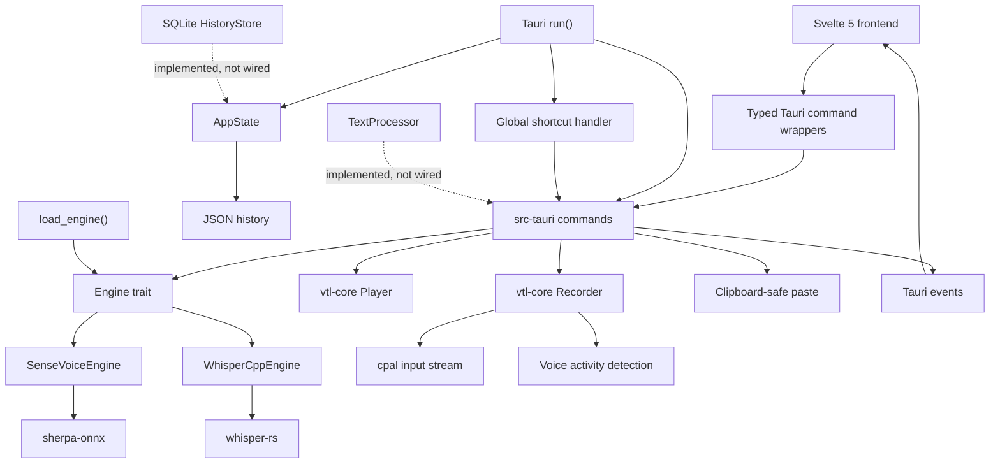

# Voice-typeless Codebase Knowledge Graph

> Generated from `codebase-memory-mcp` project `D-Voice-typeless`
> Last indexed: 2026-06-11
> Persistent artifact: `.codebase-memory/graph.db.zst`

## Graph Summary

| Metric | Value |
|---|---:|
| Nodes | 1,429 |
| Edges | 1,980 |
| Source files/modules | 86 |
| Functions | 205 |
| Methods | 122 |
| Classes | 53 |
| Interfaces | 41 |
| Rust files | 30 |
| Svelte files | 14 |
| TypeScript files | 9 |

The runtime is a direct Rust integration. The Svelte frontend invokes Tauri commands, the Tauri layer coordinates application state and operating-system integration, and `vtl-core` owns reusable audio, recognition, history, paste, hotkey, and text-processing behavior. There is no Go sidecar.

## Runtime Graph

## Primary Execution Path

1. `src-tauri/src/lib.rs::run` creates plugins, shared state, tray behavior, shortcuts, and the invoke handler.
2. `start_recording` starts the `Recorder`, subscribes to captured samples, and emits recording state.
3. `stop_recording` stops and drains audio, invokes `Engine::recognize`, optionally pastes text, and emits the result.
4. `load_engine` resolves model files and initializes either `SenseVoiceEngine` or `WhisperCppEngine`.
5. Frontend wrappers in `frontend/src/lib/tauri/commands.ts` expose the native commands to Svelte components.

## High-Impact Nodes

| Symbol | File | Graph signal |
|---|---|---:|
| `SenseVoiceEngine::load_model` | `core-rs/src/engine/sensevoice.rs` | fan-in 9 |
| `parse_key_combo` | `core-rs/src/hotkey.rs` | fan-in 8 |
| `SenseVoiceEngine::recognize` | `core-rs/src/engine/sensevoice.rs` | fan-in 8 |
| `HotkeyAction::as_str` | `core-rs/src/hotkey.rs` | fan-in 6 |
| `HistoryStore::add` | `core-rs/src/history.rs` | fan-in 6 |
| `TextProcessor::process` | `core-rs/src/processor.rs` | fan-in 5 |

Changes to these symbols should include focused unit tests plus an inbound impact trace before commit.

## Module Ownership

| Area | Responsibility | Main dependencies |
|---|---|---|
| `core-rs/src/audio` | Device enumeration, capture, playback, VAD | `cpal` |
| `core-rs/src/engine` | Model abstraction and offline recognition | `sherpa-onnx`, optional `whisper-rs` |
| `core-rs/src/history.rs` | Reusable SQLite history abstraction; not wired into Tauri runtime | `rusqlite` |
| `core-rs/src/paste.rs` | Clipboard preservation and focused-app paste | platform APIs / `arboard` |
| `core-rs/src/processor.rs` | Reusable text cleanup; not wired into `stop_recording` | core types |
| `src-tauri/src` | Native lifecycle, commands, JSON history, model management, events | Tauri v2, `vtl-core` |
| `frontend/src` | Settings, status, history, model and device UI | Svelte 5, Tauri API |

## Maintenance Workflow

After structural code changes:

1. Re-index `D:\Voice-typeless` with `index_repository(mode="full", persistence=true)`.
2. Review `get_architecture`, hotspot changes, and impacted call paths.
3. Update this document if module boundaries or primary execution paths changed.
4. Commit `.codebase-memory/graph.db.zst`, `.gitattributes`, and `artifact.json` with the source changes.
